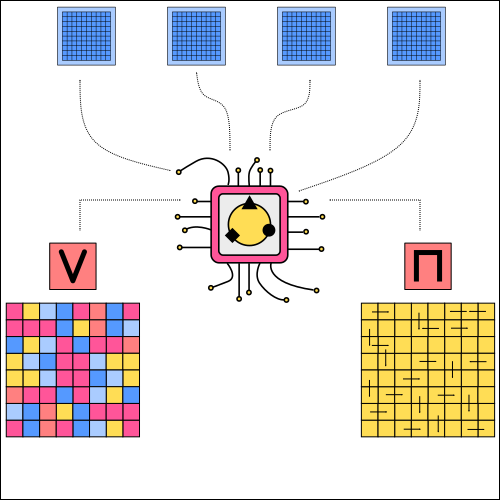

============================
Advantage Actor-Critic (A2C)
============================

Motivation
==========

The improvements to performance that were made with the asynchronous advantage actor critic (A3C) were not necessarily due to the asynchronous aspect of the algorithm. Soon after the release of the algorithm researchers found out that the performance boost comes from the experiences that are generated by different environments and not the asynchronous updates that were made with Hogwild. In A2C (advantage actor critic) several environments are generated and a batch of experiences is gathered. But the update is done centrally by a single agent. The advantage of this approach is the easier implementation and debugging, while keeping the decorelated experience tuples that result from the many distinct environments. Additionally as the update is done with experiences that can be packed into a batch, GPUs are heavily used with A2C. Common A2C implementations also make use of GAEs, which were introduced after the A3C algorithm.

   A2C Structure.

There is no single paper that can be pointed to for the A2C algorithm. But the name has become popular after OpenAI released its baseline implementations for most common state of the art reinforcement learning algorithms [#]_. 

Implementation
==============

.. danger::

    The following implementation is still unstable.

.. code:: python

    import gym
    import numpy as np

    import torch
    import torch.nn as nn
    import torch.optim as optim
    from torch.distributions.categorical import Categorical
    from collections import deque

.. code:: python

    # the actor-critic shares the first layers
    class ActorCritic(nn.Module):
        
        def __init__(self, n_features, n_actions):
            super(ActorCritic, self).__init__()
            self.shared_model = nn.Sequential(
                nn.Linear(in_features=n_features, out_features=64),
                nn.ReLU(),
                nn.Linear(in_features=64, out_features=128),
                nn.ReLU(),
            )
            self.v = nn.Sequential(
                nn.Linear(in_features=128, out_features=128),
                nn.ReLU(),
                nn.Linear(in_features=128, out_features=1)
                )

            self.pi = nn.Sequential(
                nn.Linear(in_features=128, out_features=128),
                nn.ReLU(),
                nn.Linear(in_features=128, out_features=n_actions)
                )
        
        def forward(self, x):
            x = self.shared_model(x)
            v = self.v(x)
            logits = self.pi(x)
            
            distribution = Categorical(logits=logits)
            action = distribution.sample()
            log_prob = distribution.log_prob(action)
            entropy = distribution.entropy()
            
            return v.squeeze(dim=1), action.cpu().numpy(), log_prob, entropy

.. code:: python

    class Agent():
        def __init__(self,
                    env_name,
                    n_envs,
                    n_steps,
                    max_steps,
                    actor_critic_function,
                    solved_average_reward,
                    alpha,
                    beta,
                    gamma,
                    tau,
                    device):
            
            self.env = gym.make(env_name)

            n_features = self.env.observation_space.shape[0]
            n_actions = self.env.action_space.n
            self.actor_critic = actor_critic_function(n_features, n_actions)

            self.optimizer = optim.Adam(self.actor_critic.parameters(), alpha)
            
            def make_env(env_name, seed):
                def closure():
                    env =  gym.make(env_name)
                    env.seed(seed)
                    return env
                return closure

            self.envs = gym.vector.AsyncVectorEnv([make_env(env_name, i+1) for i in range(n_envs)])
            
            self.solved_average_reward = solved_average_reward
            self.n_steps = n_steps
            self.max_steps = max_steps
            self.beta = beta
            self.gamma = gamma
            self.tau = tau
            self.device = device

            self.actor_critic.to(self.device)

            self.eval_rewards = deque(maxlen=100)
            self.avg_eval_reward_sum = float('-inf')
            self.max_eval_reward_sum = float('-inf')
            self.max_avg_eval_reward_sum = float('-inf')
  
        def reset(self):
            self.dones = []
            self.rewards = []
            self.values = []
            self.log_probs = []
            self.entropies = []
        
        def optimize(self):
            
            log_probs = torch.stack(self.log_probs)
            entropies = torch.stack(self.entropies)

            #calculate gaes
            rewards = np.stack(self.rewards)
            dones = np.stack(self.dones)
            values = torch.stack(self.values).cpu().detach().numpy()
            advantages = np.zeros_like(rewards)

            prev_gae = 0
            for t in reversed(range(self.n_steps)):
                delta = rewards[t] + self.gamma * values[t+1] * (1.0 - dones[t]) - values[t]
                prev_gae = delta + self.gamma * self.tau * (1.0 - dones[t]) * prev_gae
                advantages[t] = prev_gae

            returns = advantages + values[:-1]
            
            # OPTIMIZE
            
            #clear past gradients
            self.optimizer.zero_grad()

            values = torch.stack(self.values[:-1])
            advantages = torch.tensor(advantages, dtype=torch.float32, device=self.device)
            returns = torch.tensor(returns, dtype=torch.float32, device=self.device)
            #OPTIMIZATION
            #-----------------------------------------
            #calculate the advantages
    
            #minus to make descent from ascent
            pi_loss = -(advantages.detach() * log_probs).mean()
            entropy_loss = - self.beta * entropies.mean()
            v_loss = (returns.detach() - values).mul(0.5).pow(2).mean()
            
            loss = pi_loss + entropy_loss + v_loss
            
            #calcualte gradients
            loss.backward()
            
            #gradient descent
            self.optimizer.step()

        def learn(self):
            n_updates = self.max_steps // self.n_steps
            obs = self.envs.reset()
            step = 0

            for n_update in range(n_updates):
                self.reset()
                for _ in range(self.n_steps):
                    obs = torch.tensor(obs).to(self.device)
                    value, action, log_prob, entropy = self.actor_critic(obs)
                    next_obs, reward, done, _ = self.envs.step(action)
                    step += 1

                    self.dones.append(done)
                    self.rewards.append(reward)
                    self.log_probs.append(log_prob)
                    self.values.append(value)
                    self.entropies.append(entropy)
                    obs = next_obs

                with torch.no_grad():
                    #additional value for bootstrapping
                    bootstrapped_obs = torch.tensor(obs).to(self.device)
                    value, _, _, _ = self.actor_critic(bootstrapped_obs)
                    self.values.append(value.detach())
                
                self.optimize()

                if step % 1000 == 0:
                    print(f'\nSteps: {step}/{self.max_steps}')
                    self.evaluate()
                        
        def evaluate(self):
            with torch.no_grad():
                eval_reward_sum = 0
                obs = self.env.reset()
                done = False

                while not done:
                    obs = torch.tensor(obs).unsqueeze(dim=0).to(self.device)
                    _, action, _, _ = self.actor_critic(obs)
                    next_obs, reward, done, _ = self.env.step(action.item())
                    obs = next_obs
                    eval_reward_sum += reward
                    
                # EVALUATION AND LOGGING
                #-----------------------------------------------------------
                self.eval_rewards.append(eval_reward_sum)
                
                if eval_reward_sum > self.max_eval_reward_sum:
                    self.max_eval_reward_sum = eval_reward_sum

                self.avg_eval_reward_sum = np.mean(self.eval_rewards)
                if self.avg_eval_reward_sum > self.max_avg_eval_reward_sum:
                    self.max_avg_eval_reward_sum = self.avg_eval_reward_sum
                         
                print('--------------------------------')
                print(f'Reward Sum: {eval_reward_sum}')
                print(f'Max Reward Sum: {self.max_eval_reward_sum}')
                print(f'Avg. Reward Sum: {self.avg_eval_reward_sum}')
                print(f'Max Avg. Reward Sum: {self.max_avg_eval_reward_sum}')

.. code:: python    

    if __name__ == '__main__':
        # PARAMETERS FOR LUNAR LANDER
        ENV_NAME = 'LunarLander-v2'
        SOLVED_AVERAGE_REWARD = 200
        MAX_STEPS = 500000
        N_STEPS = 50
        ALPHA = 0.0005
        BETA = 0.01
        GAMMA = 0.99
        TAU = 0.95
        ACTOR_CRITIC_FUNCTION = ActorCritic
        N_ENVS = 8
        DEVICE = torch.device('cuda' if torch.cuda.is_available() else 'cpu')

        print(f'Working on device: {DEVICE}')

        agent = Agent(
                    env_name=ENV_NAME,
                    n_envs=N_ENVS,
                    n_steps=N_STEPS,
                    max_steps=MAX_STEPS,
                    actor_critic_function=ACTOR_CRITIC_FUNCTION,
                    solved_average_reward=SOLVED_AVERAGE_REWARD,
                    alpha=ALPHA,
                    beta=BETA,
                    gamma=GAMMA,
                    tau=TAU,
                    device=DEVICE)

        agent.learn()
            

Sources
=======

.. [#] OpenAI Baselines A2C blog post. https://openai.com/blog/baselines-acktr-a2c/