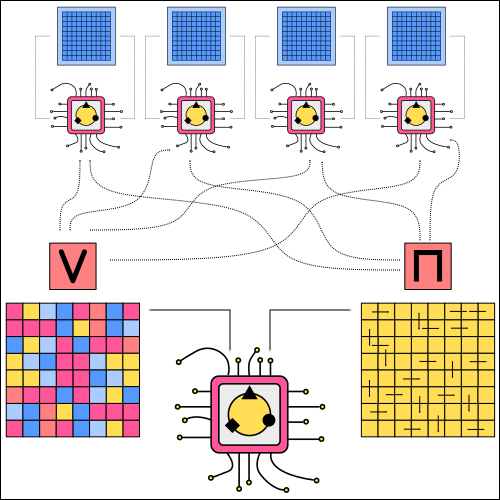
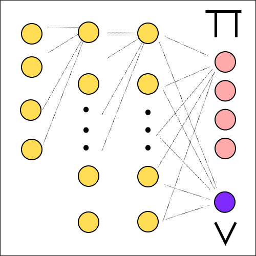

=========================================
Asynchronous Advantage Actor-Critic (A3C)
=========================================

Motivation
==========

    .. note::

        "The best performing method, an asynchronous variant of actor-critic, surpasses the current state-of-the-art on the Atari domain while training for half the time on a single multi-core CPU instead of a GPU [#]_."

Theory
======

General Structure
-----------------

   A3C Structure.

Entropy
-------

Architecture
------------

   A3C Architecture.

Implementation
==============

Sources
=======

.. [#] Mnih V. et al. Asynchronous Methods for Deep Reinforcement Learning. 2016. https://arxiv.org/abs/1602.01783

