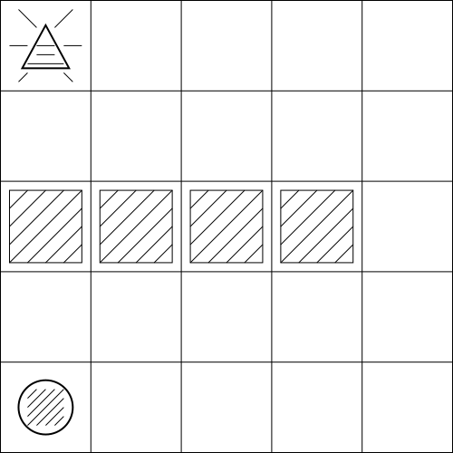

=====================
Agent and Environment
=====================

All of reinforcement learning is based on two main components, the **agent** and the **environment**. To introduce both components I will follow the customary route taken in the reinforcement learning education and use a grid world example.  

   In this grid world the circle has to reach the triangle.

In the gridworld above you have a player as represented by a circle. The player can move into 4 different directions: North, East, South and West. If the circle is against a wall (outermost lines) or a barrier (lined boxes) then he can not move in that particular direction. The goal of the game is for the circle to reach the triangle in the top left corner in as few steps as possible.

.. warning:: 
   Do not mix up the agent with its physical representation in the environment.

Intuitively I would say that the circle is the agent and the grid world is the environment the agent interacts with, but that definition would not be entirely correct. There is actually a relatively strict separation between the agent and the environment. 

.. note::
   The agent is the code that makes the decisions.

All the agent can actually do is to make the decisions. In the case of the above gridworld the agent chooses the direction, meaning north, west, east or south. Whether the circle actually moves in that direction is outside of the influence of the agent. 

.. figure:: ../_static/images/reinforcement_learning/agent_env/grid_world_barrier.svg
   :align: center

   The agent can always choose between the north, east, south or west direction.

For example in the image above the agent can decide to go north even though the circle is against a barrier in the northern direction. That decision is legitimate in many grid worlds, but the position of the circle will not change.  

   The agent is the decision maker.

The agent is the program that generates the decision and the decision of the agent is then relayed to the environment. The environment then processes the decision, but that is not something that the agent can influence. In the simple grid-world game if the agent decides to go north the circle might actually move north or it could move in a totally different direction or not move at all. 

.. note::
   Anything outside of the agent is the environment.

Once the agent is identified, everything outside of the agent is defined as the environment.

   Where is the agent? Where is the environment?

A common example that is also used to make the distinction between the agent and the environment is that of a robot that interacts with the real world. The goal of the robot might be to go from right to left to recharge the battery. The agent is the code that makes the decision to move left. While the arms, the legs, the cooling system, the floor and everything else in the image is part of the environment.  

A similar argument can be made for a human or any other form of a biological machine. The neural network in our brain makes the decisions to move, to study or to sleep. How the body actually reacts is not really in our control. For example the movement could be stopped when you are parallyzed either because of an illness or through fear. The desire to study could be stopped through external triggers like the smell of food or a habit to listen to music. And the decision to go to bed to fall asleep is not always accompanied by actual sleep. We do not have full control of our body. For example, no matter how hard we try, we can not stop our heart. 
