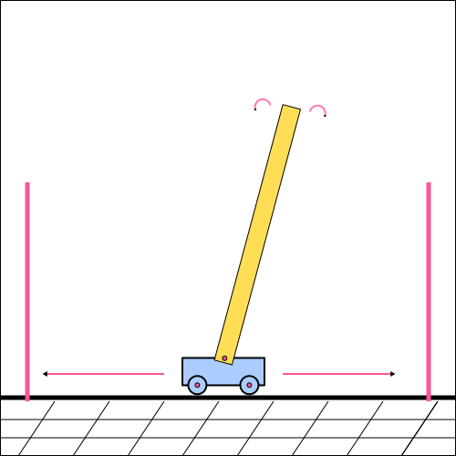

=====================
Cart Pole Environment
=====================

Usually for complex environments where modern approximative methods have to be used, a good Nvidia graphics card is required to find a solution to an MDP in a reasonable amount of time. Many of the calculations have to be moved to the GPU, because the CPU is not well suited for many parallel calculations. This is not the case for the Cart Pole environment. The environment is generally easy enough to be solved by a CPU. Cart Pole is usually the first environment that a reinforcement learning beginner tries to solve, but even more experienced users often try out their algorithms with the Cart Pole before moving to the more complex task. If the algorithm can not solve Cart Pole there is usually a bug somewhere and it is a lot easier and faster to debug Cart Pole. 

In this chapter we are going to describe the Cart Pole environment as it is defined in OpenAI Gym, but somewhat different implementations are possible. From this chapter on when we talk about Cart Pole it is safe to assume that we are using one of the Gym versions (described further below).

As the name of the environment suggests the agent has to try and balance the pole that is attached to a moving cart. 

   Cart Pole.

If the cart moves a certain distance from the center of the room (+/- 2.4 units in OpenAI Gym) or the angle of the pole exceeds a certain magnitude (+/- 12 degrees) the environment terminates with failure. The environment terminates with success when the agent is able to balance the pole for a certain number of steps. In OpenAI Gym the CartPole-v0 environment runs for 200 steps before terminating successfully while CartPole-v1 runs for 500 steps. 

The agent receives a positive reward of +1 for each step taken. The environment is considered solved when the average reward for the past 100 games is larger or equal to 195/475 in the environments CartPole-v0/CartPole-v1 respectively. 

At each time step the agent receives information regarding the cart and the pole attached to the cart. 

.. list-table:: Observations in the OpenAI Gym CartPole Environment
    :widths: 15 25 25 25
    :header-rows: 1

    * - Num
      - Observation
      - Min
      - Max
    * - 0
      - Cart Position
      - -2.4
      - 2.4
    * - 1
      - Cart Velocity
      - -Inf
      - +Inf
    * - 2
      - Pole Angle
      - -41.8°
      - +41.8°
    * - 3
      - Angular Velocity
      - -Inf
      - +Inf

The agent has the option to either select the action to move the cart to the left or to the right. 

.. list-table:: Actions in the OpenAI Gym CartPole Environment
    :widths: 15 25
    :header-rows: 1

    * - Num
      - Action
    * - 0
      - Push cart to the left
    * - 1
      - Push cart to the right

    