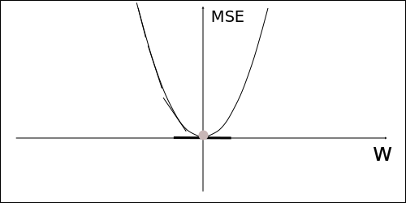

==========================
Convergence And Optimality
==========================

Problem Definition
==================

The algorithms that we discussed during the last chapters attempt to find weights that create an approximate function that is as close as possible to the true state or action value function. The measurement of closeness that is used throughout reinforcement learning is the mean squared error (MSE). But in what way does finding the weights that produce the minimal mean squared error contribute to a value function that is close to the optimal function? Therefore before we proceed to the next chapter there are several questions we have to ask ourselves. 

* Can we find the optimal state/action value function?
* What does convergence mean?
* Do the algorithms have convergence guarantees? 
* Towards what value does convergence happen?

Convergence
===========

When we talk about convergence we usually mean that as time moves along the value function of the agent changes towards some specific form. The steps towards that form get smaller and smaller and our function should have the desired form only in the limit (with an unlimited amount of improvement steps). 

What does convergence mean for prediction? For tabular methods we aspire to find the true value function of a policy :math:`\pi`. Therefore convergence means that the value function of the agent converges towards the true value function. For approximative methods the agent adjusts the weight vector through gradient descent to reduce the mean squared error and if convergence is possible the weights move towards a specific vector. That does not necessarily mean that the agent finds a weight vector that generates the smallest possible MSE, as gradient descent might get stuck in a local minimum. 

.. list-table:: Prediction Convergence
    :widths: 50 25 25 25
    :header-rows: 1

    * - Algorithm
      - Tabular
      - Linear
      - Non-Linear
    * - *Monte Carlo*
      - Converges *(True Value Function)*
      - Converges *(Global Optimum)*
      - Converges *(Local Optimum)*
    * - *Sarsa*
      - Converges *(True Value Function)*
      - Converges *(Near Global Optimum)*
      - No Convergence
    * - *Q-Learning*
      - Converges *(True Value Function)*
      - No Convergence
      - No Convergence

Monte Carlo and TD (On-Policy and Off-Policy) all converge towards the true value function for pi when the agent deals with finite MDPs and uses tabular methods. 

When we talk about approximate solutions the answers to the question whether prediction algorithms converge depend strongly on the type of algorithm.

Monte Carlo algorithms use returns as a proxy for the true value function. Returns are unbiased but noisy estimates of the true value function, therefore we have a guarantee of convergence when using gradient descent. Linear methods converge to global optimum while non-linear methods converge to a local optimum. 

  Convex MSE.

The MSE for linear monte carlo approximators is convex, which means that there is a single optimum which is guaranteed to be found.

.. figure:: ../../_static/images/reinforcement_learning/approximative_rl/convergence_optimality/local_minimum.svg
  :align: center

  Non Convex MSE.

The MSE for non-linear monte carlo approximators is non-convex, therefore gradient descent might get stuck in a local optimum.

Temporal difference methods use bootstrapping. These algorithms use estimates for the target values in the update step. That makes them biased estimators. Q-Learning especially is problematic as there is no convergence guarantee even for linear methods.   

What does convergence mean for control? For tabular methods that means to find the optimal value function and thereby policy . Therefore convergence means that the value function of the agent converges towards the optimal value function. For approximative methods convergence means that gradient descent finds either a local or a global optimum for the mean squared error between the approximate function and the true optimal function..

.. list-table:: Control Convergence
    :widths: 50 25 25 25
    :header-rows: 1

    * - Algorithm
      - Tabular
      - Linear
      - Non-Linear
    * - *Monte Carlo*
      - Converges *(Optimal Value Function)*
      - Oscilates
      - No Convergence
    * - *Sarsa*
      - Converges *(Optimal Value Function)*
      - Oscilates
      - No Convergence
    * - *Q-Learning*
      - Converges *(Optimal Value Function)*
      - No Convergence
      - No Convergence

Linear functions (MC and SARSA) oscillate around the near optimal value. For non-linear methods no convergence guarantees are given.

Optimality
==========

Finding the true optimal value function is not possible with function approximators, because the state and action space is continuous or very large and the idea is to find weights for functions that generalize well.

When we speak about optimality with function approximators we often mean that it might be possible to find weights that minimize the mean squared error between the optimal function and the approximative function. 

The most important takeaway should be that when deciding between algorithms, convergence should not be the primary decision factor. If it was then linear approximators would be the first choice. Off-policy temporal difference algorithms are often the first choice, even though according to the table above there is no convergence guarantee. 

.. figure:: ../../_static/images/reinforcement_learning/approximative_rl/convergence_optimality/linear.svg
  :align: center

  Linear Convergence.

Let us assume that in the image above the red line represents the optimal value function, which is non-linear. Even if we are able to find the minimum MSE, the linear  function (blue line) is not expressive enough to represent the optimal value function. We have no choice but to look for non-linear alternatives. 

The truth of the matter is that In practice neural networks work well, provided we use some particular techniques to prevent divergence. We will learn more about those in the next chapters. 
  