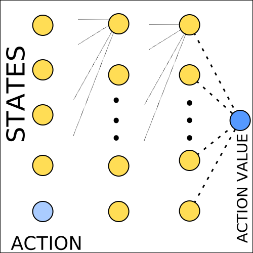

==========================
Convergence And Optimality
==========================

Problem Definition
==================

The algorithms that we discussed during the last chapters attempt to find weights that create an approximate function that is as close as possible to the true state or action value function. The measurement of closeness that is used throughout reinforcement learning is the mean squared error (MSE). But in what way does finding the weights that produce the minimal mean squared error contribute to a value function that is close to the optimal function? Therefore before we proceed to the next chapter there are several questions we have to ask ourselves. 

* Can we find the optimal state/action value function?
* What does convergence mean?
* Do the algorithms have convergence guarantees? 
* Towards what value does convergence happen?

Convergence
===========

When we talk about convergence we usually mean that as time moves along the value function of the agent changes towards some specific form. The steps towards that form get smaller and smaller and our function should have the desired form only in the limit (with an unlimited amount of improvement steps). 

What does convergence mean for prediction? For tabular methods we aspire to find the true value function of a policy :math:`\pi`. Therefore convergence means that the value function of the agent converges towards the true value function. For approximative methods the agent adjusts the weight vector through gradient descent to reduce the mean squared error and if convergence is possible the weights move towards a specific vector. That does not necessarily mean that the agent finds a weight vector that generates the smallest possible MSE, as gradient descent might get stuck in a local minimum. 

.. list-table:: Prediction Convergence
    :widths: 50 25 25 25
    :header-rows: 1

    * - Algorithm
      - Tabular
      - Linear
      - Non-Linear
    * - *Monte Carlo*
      - Converges *(True Value Function)*
      - Converges *(Global Optimum)*
      - Converges *(Local Optimum)*
    * - *Sarsa*
      - Converges *(True Value Function)*
      - Converges *(Near Global Optimum)*
      - No Convergence
    * - *Q-Learning*
      - Converges *(True Value Function)*
      - No Convergence
      - No Convergence

Monte Carlo and TD (On-Policy and Off-Policy) all converge towards the true value function for pi when the agent deals with finite MDPs and uses tabular methods. 

When we talk about approximate solutions the answers to the question whether prediction algorithms converge depend strongly on the type of algorithm.

Monte Carlo algorithms use returns as a proxy for the true value function. Returns are unbiased but noisy estimates of the true value function, therefore we have a guarantee of convergence when using gradient descent. Linear methods converge to global optimum while non-linear methods converge to a local optimum. 

.. figure:: ../../_static/images/reinforcement_learning/approximative_rl/convergence_optimality/convex.svg
  :align: center

  Convex MSE.

The MSE for linear monte carlo approximators is convex, which means that there is a single optimum which is guaranteed to be found.

.. figure:: ../../_static/images/reinforcement_learning/approximative_rl/convergence_optimality/local_minimum.svg
  :align: center

  Non Convex MSE.

The MSE for non-linear monte carlo approximators is non-convex, therefore gradient descent might get stuck in a local optimum.

Temporal difference methods use bootstrapping. These algorithms use estimates for the target values in the update step. That makes them biased estimators. Q-Learning especially is problematic as there is no convergence guarantee even for linear methods.   

What does convergence mean for control? For tabular methods that means to find the optimal value function and thereby policy . Therefore convergence means that the value function of the agent converges towards the optimal value function. For approximative methods convergence means that gradient descent finds either a local or a global optimum for the mean squared error between the approximate function and the true optimal function..

.. list-table:: Control Convergence
    :widths: 50 25 25 25
    :header-rows: 1

    * - Algorithm
      - Tabular
      - Linear
      - Non-Linear
    * - *Monte Carlo*
      - Converges *(Optimal Value Function)*
      - Oscilates
      - No Convergence
    * - *Sarsa*
      - Converges *(Optimal Value Function)*
      - Oscilates
      - No Convergence
    * - *Q-Learning*
      - Converges *(Optimal Value Function)*
      - No Convergence
      - No Convergence

Linear functions (MC and SARSA) oscillate around the near optimal value. For non-linear methods no convergence guarantees are given.

Optimality
==========

Finding the true optimal value function is not possible with function approximators, because the state and action space is continuous or very large and the idea is to find weights for functions that generalize well.

When we speak about optimality with function approximators we often mean that it might be possible to find weights that minimize the mean squared error between the optimal function and the approximative function. 

The most important takeaway should be that when deciding between algorithms, convergence should not be the primary decision factor. If it was then linear approximators would be the first choice. Off-policy temporal difference algorithms are often the first choice, even though according to the table above there is no convergence guarantee. 

.. figure:: ../../_static/images/reinforcement_learning/approximative_rl/convergence_optimality/linear.svg
  :align: center

  Linear Convergence.

Let us assume that in the image above the red line represents the optimal value function, which is non-linear. Even if we are able to find the minimum MSE, the linear  function (blue line) is not expressive enough to represent the optimal value function. We have no choice but to look for non-linear alternatives. 

The truth of the matter is that In practice neural networks work well, provided we use some particular techniques to prevent divergence. We will learn more about those in the next chapters. 

Cart Pole: Naive Neural Network Q-Learning
========================================== 

To demonstrate the general functionality of the naive implementation of Q-Learning in a neural network setting we are going to try to solve the cart pole environment in OpenAI gym. 

Algorithm
---------

The algorithm below shows how the implementation should theoretically look like. For a given amount of episodes the agent interacts with the environment. To balance exploration and exploitation the actions are selected using epsilon-greedy action selection strategy. The agent applies so-called online learning, meaning that for each step of the episode the agent updates the weights :math:`\mathbf{w}` using the most recent information. After the update the information is thrown away. 

.. math::
  :nowrap:

  \begin{algorithm}[H]
      \caption{Q-Learning with a Neural Network}
      \label{alg1}
  \begin{algorithmic}
      \STATE Input: Environment for interaction, $env$
      \STATE Input: Neural Network initialized randomly (q-function) $\hat{q}$
      \STATE Input: Number of episodes
      \STATE Input: Learning Rate alpha $\alpha$
      \STATE Input: Exploration Rate epsilon $\epsilon$
      \STATE Input: Discount Rate gamma $\gamma$
      \FOR{$episode=0$ to number of episodes}
        \STATE Initialize $env$ and get initial state $S$
        \REPEAT
          \STATE Select action $A$ based on $S$ using $\epsilon$-greedy action selection
          \STATE Observe reward $R$ and state $S'$
          \STATE $\mathbf{w} \leftarrow \mathbf{w} + \alpha[R + \gamma\max_a\hat{q}(S',a, \mathbf{w}) - \hat{q}(S, A, \mathbf{w})]\nabla\hat{q}(S, A, \mathbf{w})$
          \STATE $S \leftarrow S'$
        \UNTIL{State $S'$ is terminal}
      \ENDFOR
  \end{algorithmic}
  \end{algorithm}

PyTorch Implementation
----------------------

To implement the algorithm we only need OpenAI gym for the environment, NumPy for several convenience functions and PyTorch for the automatic gradient calculation and backpropagation. 

.. code:: python

  import gym
  import numpy as np

  import torch
  import torch.nn as nn
  import torch.optim as optim

The neural network takes the feature vector consisting of 4 variables from the cart pole environment and the action the agent would like to take. The output is a single number representing the action-value of the state action pair. Generally the developer can create any hidden layer representation. In this example we have 2 hidden layers with 10 neurons each. Aside from the output layer each neuron uses the relu activation function.  

  Q-Function Architecture.

.. code:: python

  class Q(nn.Module):
    
    def __init__(self):
        super(Q, self).__init__()
        self.model = nn.Sequential(
            nn.Linear(5, 10),
            nn.ReLU(),
            nn.Linear(10, 10),
            nn.ReLU(),
            nn.Linear(10, 10),
            nn.ReLU(),
            nn.Linear(10, 1)
        )
        
    def forward(self, state, action):
        x = torch.cat((state, action), dim=1)
        return self.model(x)

The calculations are going to be performed on the GPU if a CUDA graphics card is installed on the system. The cart pole environment is easy enough to be solved by a CPU. 

.. code:: python

  DEVICE = torch.device('cuda:0' if torch.cuda.is_available() else 'cpu')

The agent is the class that is responsible for interacting with the environment and for updating the weights of the neural network. Altogether the class has 5 methods.

* The __init__() method initializes the agent with the variables described in the algorithm definition above. Additionally some more variables are created to track the performance of the algorithm.
* The greedy_action() method calculates the values of the different actions and returns the action with the highest value.
* The select_action()  method uses the epsilon-greedy selection technique. After each action selection step the epsilon variable is reduced until it converges to the minimum possible :math:`\epsilon` value.
* The evaluate() method interacts with the environment only using the greedy selection scheme. The method is primarily used to measure the performance of the agent.
* The learn() method is the heart of the agent. It is the method that is responsible for updating the weights of the neural network using Q-Learning.
  

.. code:: python

  class Agent:
      
      def __init__(self, env, q_function, episodes, epsilon_start, epsilon_end, epsilon_step, alpha, gamma):
          
          self.env = env
          self.q_function = q_function
          
          self.optimizer = optim.Adam(self.q_function.parameters(), alpha)
          self.criterion = nn.MSELoss()
          
          self.episodes = episodes
          self.epsilon = epsilon_start
          self.epsilon_end = epsilon_end
          self.epsilon_step = epsilon_step
          self.gamma = gamma
          
          # save sum of rewards after each evaluation episode
          self.rewards_list = []
          # save average reward for each 100 episodes
          self.avg_rewards_list = []
          # max sum of rewards seen so far in a single game
          self.max_reward = 0
          # max average sum of rewards over 100 games seen so far
          self.max_avg_rewards = 0
          
      # select greedy action
      def greedy_action(self, obs):
          with torch.no_grad():
              obs = torch.tensor(obs, dtype=torch.float32).unsqueeze(dim=0).to(DEVICE)
              action_left = torch.tensor([[0]], dtype=torch.float32).to(DEVICE)
              action_right = torch.tensor([[1]], dtype=torch.float32).to(DEVICE)

              if self.q_function(obs, action_left) > self.q_function(obs, action_right):
                  action = 0
              else:
                  action = 1
              return action

      # act epsilon greedy
      def select_action(self, obs):
          if np.random.rand() < self.epsilon:
              action = self.env.action_space.sample()
          else:
              action = self.greedy_action(obs)

          self.epsilon = self.epsilon - self.epsilon_step
          if self.epsilon < self.epsilon_end:
              self.epsilon = self.epsilon_end

          return action
      
      # play an episode using only greedy action selection
      def evaluate(self, episode):
          
          done = False
          obs = self.env.reset()
          reward_sum = 0
          
          while not done:
              action = self.greedy_action(obs)
              next_obs, reward, done, _ = self.env.step(action)
              obs = next_obs
              reward_sum += reward
              
          self.rewards_list.append(reward_sum)
          if reward_sum > self.max_reward:
              self.max_reward = reward_sum
          
          if len(self.rewards_list) >= 100:
              avg_reward = np.mean(self.rewards_list[-100:])
              if avg_reward > self.max_avg_rewards:
                  self.max_avg_rewards = avg_reward
              self.avg_rewards_list.append(avg_reward)
              print('--------------------------------')
              print(f'Episode: {episode}/{EPISODES}')
              print(f'Epsilon: {self.epsilon}')
              print(f'Reward Sum: {reward_sum}')
              print(f'Max Reward Sum: {self.max_reward}')
              print(f'Avg. Reward Sum: {avg_reward}')
              print(f'Max Avg. Reward Sum: {self.max_avg_rewards}')

      # play an episode using epsilon-greedy action selection and learn from each step of the episode
      def learn(self):
          
          # play for a predetermined number of episodes
          for episode in range(self.episodes):
              done = False
              obs = self.env.reset()

              while not done:
                  action = self.select_action(obs)       
                  next_obs, reward, done, info = self.env.step(action)
                  next_action = self.greedy_action(next_obs)

                  # push all those variables to the device (GPU or CPU)
                  obs_t = torch.tensor(obs, dtype=torch.float32).unsqueeze(dim=0).to(DEVICE)
                  action_t = torch.tensor(action, dtype=torch.float32).view(1, 1).to(DEVICE)
                  next_obs_t = torch.tensor(next_obs, dtype=torch.float32).unsqueeze(dim=0).to(DEVICE)
                  next_action_t = torch.tensor(next_action, dtype=torch.float32).view(1, 1).to(DEVICE)
                  reward_t = torch.tensor(reward, dtype=torch.float32).view(1, 1).to(DEVICE)
                  terminal_t = torch.tensor(done, dtype=torch.float32).view(1, 1).to(DEVICE)
                  
                  if info:
                      if 'TimeLimit.truncated' in info and info['TimeLimit.truncated'] == True:
                          print('--------------------------------')
                          print('TRUNCATED')
                          terminal_t = torch.tensor(False, dtype=torch.float32).view(1, 1).to(DEVICE)
                          print('--------------------------------')
                          
                  self.optimizer.zero_grad()
                  with torch.no_grad():
                      target = reward_t + self.gamma * self.q_function(next_obs_t, next_action_t) * (1 - terminal_t)

                  online = self.q_function(obs_t, action_t)

                  loss = self.criterion(online, target)
                  loss.backward()
                  self.optimizer.step()
                  obs = next_obs
                  
              self.evaluate(episode+1)

.. code:: python

  ENV = gym.make('CartPole-v1')
  EPISODES = 1000
  ALPHA = 0.001
  GAMMA = 0.95
  EPSILON_END = 0.01
  EPSILON_START = 1
  EPSILON_STEP = 0.00005
  Q_FUNCTION = Q()
  Q_FUNCTION.to(DEVICE)

.. code:: python

    agent = Agent(env=ENV,
                q_function=Q_FUNCTION,
                episodes=EPISODES, 
                epsilon_start=EPSILON_START, 
                epsilon_end=EPSILON_END, 
                epsilon_step=EPSILON_STEP,
                alpha=ALPHA,
                gamma=GAMMA)

.. code:: python

    agent.learn()

All things considered this naive implementation can deal with the cart pole environment relatively well. In some of the 1000 games the agent was able to collect the full reward of 500. The maximum average reward over 100 games was over 250 (although these numbers change from run to run). Yet as with many off-policy reinforcement learning algorithms the performance of the agent degraded once the performance of 500 was achieved. It is of course possible to save the weights of the agent that shows the performance of 500 and to let the agent then play 100 games in a row. It is entirely possible that the agent will get the average performance of 475, thereby solving the environment. But this agent will definitely not be able to deal with more complex algorithms. So let us move on to those algorithms that can actually solve Atari and other interesting environments.
