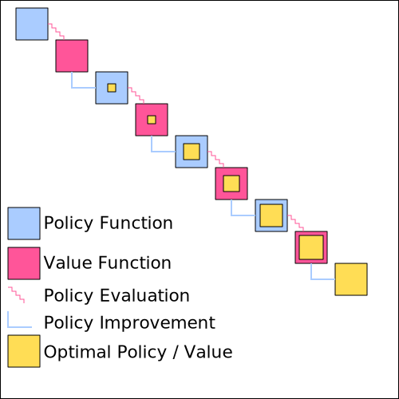
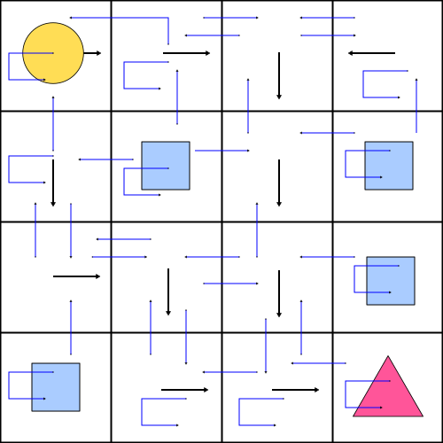
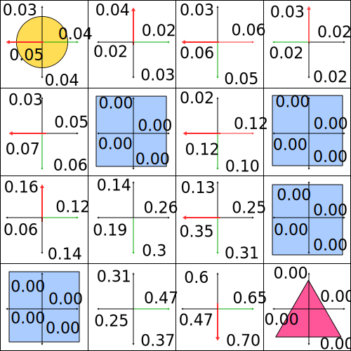

================
Policy Iteration
================

The policy iteration algorithm is an iterative method. Iterative methods start with initial (usually random or 0) values as approximations and improve the subsequent approximations with each iteration using the previous approximations as input. 

.. figure:: ../../_static/images/reinforcement_learning/dynamic_programming/policy_iteration/iterative_algorithm.svg
   :align: center

   Iterative Algorithm.

The above image shows the general idea of an iterative algorithm. The blue box in the top left corner is the initial value. To arrive at the value for the next box, the value of the previous box is used as input. Each of the boxes gets closer and closer to the desired value, as indicated by the yellow box at the bottom right corner.

The policy iteration algorithm consists of two steps. 

* The policy evaluation step calculates the value function for a given policy. 
* The policy improvement step improves the given policy based on the calculated value function. 

Both steps run after each other to form the policy iteration algorithm. 

   Policy Iteration.

The algorithm starts with the definition of an arbitrary policy (blue box in the top left corner). The policy can be random or it can be defined by the user. In both cases the algorithm will find an optimal policy, yet the closer the starting policy is to the optimal policy, the faster policy iteration will converge. For the given policy a policy evaluation step is applied, meaning that we find the value function (first red box) for that policy. Policy evaluation requires many steps to find the correct value function for a policy, as indicated by a wiggly line. The policy improvement step takes the calculated value function to improve the previous policy. Unlike policy evaluation, policy improvement takes only one step, as indicated by a direct line. Each policy evaluation and policy improvement step gets closer to the optimal policy/value function as indicated by the growing yellow box. 

Policy Evaluation
=================

Theory
------

The goal of policy evaluation is to find the true value function :math:`v_{\pi}` of the policy :math:`\pi`. 

.. math::
    :nowrap:

    \begin{align*}
    v_{\pi}(s) & \doteq \mathbb{E}_{\pi}[G_t \mid S_t = s] \\
    & = \mathbb{E}_{\pi}[R_{t+1} + \gamma G_{t+1} \mid S_t = s] \\
    & = \mathbb{E}_{\pi}[R_{t+1} + \gamma v_{\pi}(S_{t+1}) \mid S_t = s] \\
    & = \sum_{a}\pi(a \mid s)\sum_{s', r}p(s', r \mid s, a)[r + \gamma v_{\pi}(s')]
    \end{align*}

When we have a deterministic policy the expression is slightly easier.

.. math::

    v_{\pi}(s) \doteq \sum_{s', r}p(s', r \mid s, \mu(s))[r + \gamma v_{\pi}(s')]

When we start the policy evaluation algorithm, the first step is to create a lookup table for the value of each state. The initial values are set either randomly or to zero (terminal states should be set to 0). When we start to use the above equation we will not surprisingly discover that the random/zero lookup table (the left side of the above equation) and the expected value of the reward plus value for the next state (the right side of the above equation) will diverge quite a lot. The goal of the policy evaluation algorithm is to make the left side of the equation and the right side of the equation be exactly equal. That is done in an iterative process where at each step the difference between both sides is reduced. In practice we do not expect the difference between the two to go all the way down to zero. Instead we define a threshold value. For example a threshold value of 0.0001 indicates that we can interrupt the iterative process as soon as for all of the states the difference between the left and the right side of the equation is below the value. 

How exactly does the iterative process work? The policy evaluation algorithm uses the mathematical definition of the value function and turns it into an iterative algorithm.

.. math::
    v_{k+1}(s) \doteq \sum_{a}\pi(a \mid s)\sum_{s', r}p(s', r \mid s, a)[r + \gamma v_{k}(s')]

At each iteration step :math:`k+1` the left side of the equation is updated by using the state values from the previous iteration and the model of the MDP. At this point it should become apparent why the Bellman equation is useful. Only the reward from the next time step is required to improve the approximation, because all subsequent rewards are already condensed into the value function from the next time step. That allows the algorithm to use the model to look only one step into the future for the reward and use the approximated value function for the next time step. By repeating the update step over and over again the rewards are getting embedded into the value function and the approximation gets better and better. It can be shown mathematically that if the update step is repeated an unlimited number of times, the approximate value function approaches the true value function of the policy. In practice the improvement is done as long as the value function between two iterations is large enough. 

   Policy Evaluation.

The above image shows the interdependencies between the values at different states. The large arrows indicate the policy for which we want to calculate the value function. The smaller blue arrows show from what states the rewards and values are needed to calculate the update of the value function. For example in the top left corner (the initial state) the agent deterministically chooses the action to move right. There is a chance to stay in the same state, to move right or to move bottom with 33.3% probability. Consequently the rewards and values of those states are required for the update. If you look carefully you can detect different paths that lead all the way from the bottom right corner (the goal state) to the top left corner. These are the paths that propagate the reward of 1 to the starting state. 

Algorithm
---------

.. math::
    :nowrap:

    \begin{algorithm}[H]
        \caption{Iterative Policy Evaluation (Deterministic Case)}
        \label{alg1}
    \begin{algorithmic}
        \STATE Input: policy $\mu$, model $p$, state set $\mathcal{S}$, stop criterion $\theta > 0$, discount factor $\gamma$
        \STATE Initialize: $V(s)$ and $V_{old}(s)$, for all $s \in \mathcal{S}$ with zeros
        \REPEAT
            \STATE $\Delta \leftarrow 0$
            \STATE $V_{old}(s) = V(s)$ for all $s \in \mathcal{S}$
            \FORALL{$s \in \mathcal{S}$}
                \STATE $V(s) \leftarrow \sum_{s', r}p(s', r \mid s, \mu(s))[r + \gamma V_{old}(s')]$
                \STATE $\Delta \leftarrow \max(\Delta,|V_{old}(s) - V(s)|)$
            \ENDFOR
        \UNTIL{$\Delta < \theta$}
        \STATE Output: value function $V(s)$
    \end{algorithmic}
    \end{algorithm}

In order to calculate the value function the algorithm needs 5 inputs.

* The deterministic policy :math:`\mu` is a function that gets a state :math:`s` as an input and generates an action :math:`a` as an output. We are not going to deal with stochastic agents yet, therefore :math:`\pi(a \mid s) = 1` in the update step. :math:`a = \mu (s)` 
* The model p will take the current state and action as input and return the next state, the reward, the terminal flag and the corresponding probability. :math:`probability, next\_state, reward, is\_terminal = p(s, a)` 
* :math:`\mathcal{S}` is the state set of the MDP
* Theta :math:`\theta`  is the criterion to stop the algorithm once the difference between the old value function :math:`V_{old}` and new value function :math:`V` is less than :math:`\theta`
* Gamma :math:`\gamma` is the discount factor for the update step in the Bellman equation

We are going to keep two versions of the value function, :math:`V_{old}` and :math:`V`. During an update iteration we move through the states one at a time. In my opinion it is more intuitive to update all the states with old values before updating the value function as a whole. If we used only one value function we would update some of the states with the already updated values and some with old values. Both versions of updates are valid, but the “inplace” version is not going to be used in this chapter. 

At each time step we loop through all states and adjust :math:`V(s)` for that particular state :math:`s` using the Bellman equation. Once the difference between :math:`V_{old}(s)` and :math:`V(s)` for all :math:`s \in S` is smaller than :math:`\theta` we leave the loop and return the value function.

Implementation
--------------

The imports consist only of OpenAI Gym and NumPy. Gym for the MDP and NumPy to make calculations more efficient. 

.. code:: python

    import gym
    import numpy as np

We are going to calculate the value function for the Frozen Lake environment, but the algorithm is general and can be applied to many different MDPs.

.. code:: python

    env = gym.make('FrozenLake-v0')

The policy function contains internally a mapping table that maps states to actions deterministically. This policy corresponds to the policy discussed above and in previous lectures. 

.. code:: python

    def policy(state):
    #     LEFT = 0
    #     DOWN = 1
    #     RIGHT = 2
    #     UP = 3
    
        mu = {
            0: 2,
            1: 2,
            2: 1,
            3: 0,
            4: 1, 
            5: 1,
            6: 1,
            7: 1,
            8: 2,
            9: 1,
            10: 1,
            11: 1,
            12: 2,
            13: 2,
            14: 2,
            15: 2   
        }
        
        return mu[state]

The model returns the list of possible next states, rewards and corresponding probabilities given the current state and action.

.. code::

    def model(state, action):
        return env.P[state][action]

The state set :math:`\mathcal{S}` and action set is :math:`\mathcal{A}` are implemented as lists.

.. code::

    S = [x for x in range(env.observation_space.n)]
    A = [x for x in range(env.action_space.n)]

The below code covers the actual policy evaluation algorithm. 

.. code::

    def policy_evaluation(policy, model, S, theta=0.00001, gamma=0.99):
        # initialize value functions with zeros
        V = np.zeros(len(S))
        V_old = np.zeros(len(S))
        
        while True:
            delta = 0
            V_old = V.copy()
            for state in S:
                # we avoid the loop over the actions as the policy is deterministic
                action = policy(state)
        
                value = 0
                for prob, next_state, reward, done in model(state, action):
                    value += prob * (reward + gamma * V_old[next_state] * (not done))
                V[state] = value
                
            # check for stop criterion and break if necessary
            max_diff = np.max(np.abs(V - V_old))
            if max_diff < theta:
                break
                
        return V

.. code::

    policy_evaluation(policy, model, S)

Policy Improvement
==================

Theory
------

Remember what it means to solve an MDP? 

.. note::

    To solve an MDP is to find an optimal policy.  

What do we need to find an optimal policy for a finite MDP?

.. note::
	To find an optimal policy for a finite MDP the optimal value-function is required.

The policy evaluation step is a prerequisite to compare two policies and to determine which is better, but an additional step, policy improvement, is required to take an existing policy and to make it better. 

There is a line of arguments that has to be made in order to show that the policy improvement step is a valid approach. 

Let us assume that we have a policy :math:`\mu(s)` and contemplate if instead of following the policy strictly, in the current state :math:`s` just once we would like to take a different action :math:`a \neq \mu(s)`. After that action we will stick to the old policy :math:`\mu` and follow it until the terminal state :math:`T`. The value of using the action :math:`a` at state :math:`s` and then following the policy :math:`\mu` is essentially the definition of the action-value function, which plays a key role in the policy improvement step. 

.. math:: 
    q_{\mu}(s, a) \doteq \mathbb{E}[R_{t+1} + \gamma v_{\mu}(S_{t+1}) \mid S_t = s, A_t = a]

What if we compare :math:`v(s)` and :math:`q(s, a)` and we find out that taking some action :math:`a` and then following :math:`\mu` generates an advantage?

.. math::
   q_{\mu}(s, a) > v_{\mu}(s)

Does that suggest that we should always take the action :math:`a` when we face the state :math:`s` and thus adjust the policy to create a new policy :math:`\mu'` or should we stick to the old policy :math:`\mu`? The policy improvement theorem suggests the former.

.. note::
    
    Policy Improvement theorem

    .. math::
        q_{\mu}(s, \mu'(s)) \geq v_{\mu}(s) \Rightarrow v_{\mu'}(s) \geq v_{\mu}(s), \forall s \in \mathcal{S}

.. note::
    
    Policy Improvement Theorem Proof

    .. math::
        :nowrap:

        \begin{align*}
        v_{\mu}(s) & \leq q_{\mu}(s, \mu'(s)) \\
        & = \mathbb{E}[R_{t+1} + \gamma v_{\mu}(S_{t+1}) \mid S_t = s, A_t = \mu'(s)] \\
        & \leq \mathbb{E}[R_{t+1} + \gamma q_{\mu}(S_{t+1}, \mu'(S_{t+1})) \mid S_t = s, A_t = \mu'(s)] \\
        & = \mathbb{E}[R_{t+1} + \gamma \mathbb{E}[R_{t+2} + \gamma v_{\mu}(S_{t+2}) \mid S_{t+1}, A_{t+1} = \mu' (S_{t+1})] \mid S_t = s, A_t = \mu'(s)] \\
        & \vdots \\
        & \leq \mathbb{E}_{\mu'}[R_{t+1} + \gamma R_{t+2} + \gamma^2 R_{t+3} + ... \mid S_t = s] \\
        & = v_{\mu'}(s)
        \end{align*}

How can we implement the proof of the policy improvement theorem into an algorithm? At each iteration step for at least one state we have to find an action that would create a higher value. If we find such an action we create a new policy :math:`\mu’` that always takes the new action :math:`a` at state :math:`s`. The question still remains: how do you find such an action? The simplest strategy would be to look at all the actions at state :math:`s` and choose the one that generates the highest value. The approach is undertaken for all states :math:`s \in \mathcal{S}`. 

.. math::

    \mu'(s) = \arg\max_a q_{\mu}(s, a)

.. note::
    Greedy means acting short-sighted by maximizing the short term gain.
    
By creating :math:`\mu'` we create a so-called greedy policy, but acting greedily means acting according to the policy improvement theorem, which guarantees an overall better policy. 

   Policy Improvement With Greedy Action-Selection.

The above image shows how the action-value looks like for the policy used throughout the chapter. The green lines show the current deterministic actions based on the state. The red arrows show the new policy based on greedy action-selection.  

Implementation
--------------

The policy improvement algorithm with greedy action selection can be constructed with one single function. 

.. code:: python

    def policy_improvement(V, model, S, A, gamma=0.99):
        
        Q = np.zeros(shape=(len(S), len(A)))
        for state in S:
            for action in A:
                for prob, next_state, reward, done in model(state, action):
                    Q[state][action] += prob * (reward + gamma * V[next_state] * (not done))
            
        
        policy_mapping = Q.argmax(axis=1)
        policy = lambda state: policy_mapping[state]
        return policy

Solving An MDP
==============

Theory
------
The idea of policy iteration is to alternate between policy evaluation and policy improvement until the optimal policy has been reached. Once the new policy and the old policy are exactly the same then we have reached the optimal policy.

Algorithm
---------

.. math::
    :nowrap:

    \begin{algorithm}[H]
        \caption{Policy Iteration (Deterministic Policy)}
        \label{alg1}
    \begin{algorithmic}
        \STATE Input: model $p$, state set $\mathcal{S}$, action set $\mathcal{A}$, stop criterion $\theta > 0$, discount factor $\gamma$
        \STATE Initialize: 
        \STATE $V(s)$ and $V_{old}(s)$, for all $s \in \mathcal{S}$ with zeros
        \STATE $\mu(s) \in \mathcal{A}(s)$ randomly
        \STATE Policy Iteration
        \REPEAT
            \STATE Policy Evaluation
            \REPEAT
                \STATE $\Delta \leftarrow 0$
                \STATE $V_{old}(s) = V(s)$ for all $s \in \mathcal{S}$
                \FORALL{$s \in \mathcal{S}$}
                    \STATE $V(s) \leftarrow \sum_{s', r}p(s', r \mid s, \mu(a))[r + \gamma V_{old}(s')]$
                    \STATE $\Delta \leftarrow \max(\Delta,|V_{old}(s) - V(s)|)$
                \ENDFOR
            \UNTIL{$\Delta < \theta$}
            \STATE Policy Improvement
            \STATE policy-stable $\leftarrow$ true 
            \FORALL{$s \in \mathcal{S}$}
                \STATE old-action $\leftarrow \mu(s)$ 
                \STATE $\mu(s) \leftarrow \arg\max_a \sum_{s', r}p(s', r \mid s, a)[r + \gamma V(s')]$
                \IF{old-action $\neq \mu(s)$}
                    \STATE policy-stable $\leftarrow$ false
                \ENDIF
            \ENDFOR
        \UNTIL policy-stable
        \STATE Output: policy function $\mu(s)$, value function $V(s)$
    \end{algorithmic}
    \end{algorithm}

The policy iteration algorithm alternates between policy evaluation and policy improvement. The algorithm continuous until a stable policy is reached.

Implementation
--------------

We will start with a random policy and still arrive at an optimal policy.

.. code:: python

    def random_policy(S, A):
        policy_mapping = np.random.randint(low=0, high=len(A), size=len(S))
        return lambda x: policy_mapping[x]

The below function compares if two policies are equal.

.. code:: python

    def policies_equal(policy_1, policy_2, S):
        equal = True
        for state in S:
            if policy_1(state) != policy_2(state):
                equal = False
                break
                
        return equal

The policy iteration algorithm calls policy_evaluation and policy_improvement functions and determines if the old and the new policy are equal. Once they are the iterative process is stopped and the loop is broken.

.. code:: python

    def policy_iteration(model, S, A, theta=0.00001, gamma=0.99):
        policy = random_policy(S, A)
        
        while True:
            V = policy_evaluation(policy, model, S, theta, gamma)
            greedy_policy = policy_improvement(V, model, S, A, gamma)
            
            if policies_equal(policy, greedy_policy, S):
                break
            
            policy = greedy_policy
            
        return policy, V