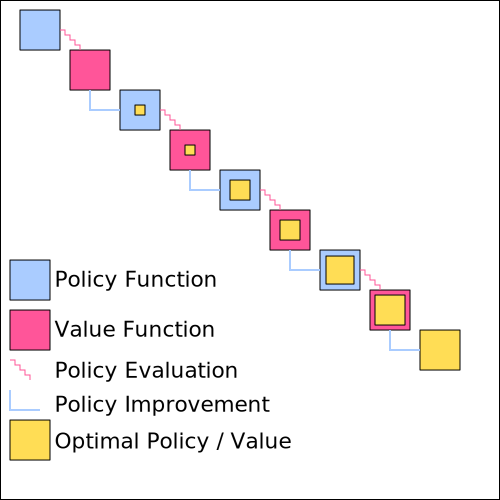

===============
Value Iteration
===============

Theory
======

   Policy Iteration.

When we consider policy iteration again, we remember that there are two distinct steps, policy evaluation and policy improvement. The policy improvement step is a single step, where the new policy is derived by acting greedily. The policy evaluation on the other hand is a longer iterative process. 

.. note::
    A policy evaluation algorithm that is stopped  early is called a “truncated” policy evaluation.

It turns out that it is not necessary to wait for the policy evaluation algorithm to finish. A truncated policy evaluation algorithm is sufficient to generate an optimal policy. Value iteration algorithm works with only one step of policy evaluation. 

   Value Iteration.

The image above shows that policy iteration and value iteration are related. The only difference is the policy evaluation step, which is done in policy iteration for many steps until convergence and in value iteration for just a single step. 

.. note::
    Value Iteration is the Bellman optimality equation, transformed from equation to an update step. 

.. math::
    :nowrap:

    \begin{align*}
    v_{k+1}(s) & \doteq \max_a \mathbb{E}[R_{t+1} + \gamma v_k (S_{t+1}) \mid S_t = s, A_t = a] \\
    & = \max_a \sum_{s', r} p(s', r \mid s, a) [r + \gamma v_k (s')]
    \end{align*}

In policy evaluation 

Although the update step looks like a single step it actually combines truncated policy evaluation and policy improvement in a single step.

1) :math:`q_{k+1}(s, a) = \sum_{s', r} p(s', r \mid s, a) [r + \gamma v_k (s')]`
2) :math:`v_{k+1}(s) = \max_a q_{k+1}(s, a)`

In the first step the action-value function is calculated based on the old state-value function and the model of the MDP. In the second step a max over the action-value function is taken in order to generate the new state-value function. That implicitly generates a new policy as a value function is always calculated for a particular policy.

The combination of both is the value iteration algorithm. The iterative process continues until the difference between the old and the new state-value function is smaller than some parameter theta :math:`\theta`. As a final step the optimal policy can be deduced using the argmax over the optimal action-value function. 

Algorithm
=========

.. math::
    :nowrap:

    \begin{algorithm}[H]
        \caption{Value Iteration}
        \label{alg1}
    \begin{algorithmic}
        \STATE Input: model $p$, state set $\mathcal{S}$, action set $\mathcal{A}$, stop criterion $\theta > 0$, discount factor $\gamma$
        \STATE Initialize: 
        \STATE $V(s)$ and $V_{old}(s)$, for all $s \in \mathcal{S}$ with zeros
        \REPEAT
            \STATE $\Delta \leftarrow 0$
            \STATE $V_{old}(s) = V(s)$ for all $s \in \mathcal{S}$
            \FORALL{$s \in \mathcal{S}$}
                \FORALL{$a \in \mathcal{A}$}
                    \STATE $Q(s, a) \leftarrow \sum_{s', r}p(s', r \mid s, a)[r + \gamma V_{old}(s')]$
                \ENDFOR
                \STATE $V(s) \leftarrow \max_a Q(s, a)$
                \STATE $\Delta \leftarrow \max(\Delta,|V_{old}(s) - V(s)|)$
            \ENDFOR
        \UNTIL{$\Delta < \theta$}
        \STATE $\mu(s) = \arg\max_a Q(s, a)$
        \STATE Output: value function $V(s)$ and policy $\mu(s)$
    \end{algorithmic}
    \end{algorithm}

The policy iteration and value iteration algorithms are similar. For example the inputs and the outputs of both algorithms are exactly the same. But value iteration is simpler due to the truncated policy evaluation step.

Implementation
==============

.. code:: python

    import gym
    import numpy as np

.. code:: python

    env = gym.make('FrozenLake-v0')

.. code:: python

    S = [x for x in range(env.observation_space.n)]
    A = [x for x in range(env.action_space.n)]

.. code:: python

    def model(state, action):
        return env.P[state][action]

Unlike policy iteration, value iteration is usually not split into separate functions for evaluation and improvement. Due to the truncated evaluation step the readability can be guaranteed without the overhead of separate functions.

.. code:: python

    def value_iteration(model, S, A, theta=0.00001, gamma=0.99):
        V = np.zeros(len(S))
        V_old = V.copy()
        
        while True:
            Q = np.zeros(shape=(len(S), len(A)))
            V_old = V.copy()
            
            #truncated policy evaluation
            for state in range(len(S)):
                for action in range(len(A)):
                    for prob, next_state, reward, done in model(state, action):
                        Q[state][action] += prob * (reward + V_old[next_state] * (not done))
            
            
            #policy improvement
            V = np.max(Q, axis=1)
            
            #check for stop criterion
            max_diff = np.max(np.abs(V - V_old))
            if max_diff < theta:
                policy_mapping = np.argmax(Q, axis=1)
                policy = lambda x: policy_mapping[x]
                return policy, V
