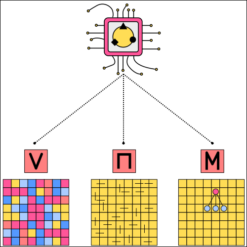

==================================
Reinforcement Learning Terminology
==================================

In this chapter we are going to look at some terminology that is used throughout reinforcement learning and at how reinforcement learning algorithms can be classified based on the components the agent has.

   Components of the agent.

Value Based vs Policy Based
===========================

Especially beginner level reinforcement learning agents have only a value function. In that case the policy of the agent is implicitly derived from the value function. Reinforcement learning methods that only utilize the value function are called *value based methods*. If on the other hand the agent derives the policy directly without using value functions the methods are called *policy based methods*. Most modern algorithms have agents with both components. Those are called *actor-critic methods*.  

Model Based vs Model Free
=========================

If the agent has an internal representation of the model as a component, the algorithms are called *model based*. If the agent learns the policy without a model, the algorithms are called *model free*.

Learning vs Planning
====================

In many cases the agent has no access to the model of the environment or has no internal representation of the model. Therefore the agent has to interact with the environment to improve the policy. In reinforcement learning this is called *learning*. If the agent on the other hand utilizes the model to improve the value function or the policy, we call it *planning*. 

Prediction vs Improvement vs Control
====================================

There are several tasks an agent might need to perform. We talk about the *prediction* task when we have a certain policy and the agent has to calculate the exact value policy for that policy. We talk about the *improvement* task when we want to improve a given policy. And we talk about the *control* task when the agent has to find the best possible policy. As you can imagine, prediction and improvement are necessary steps to solve the control problem.
