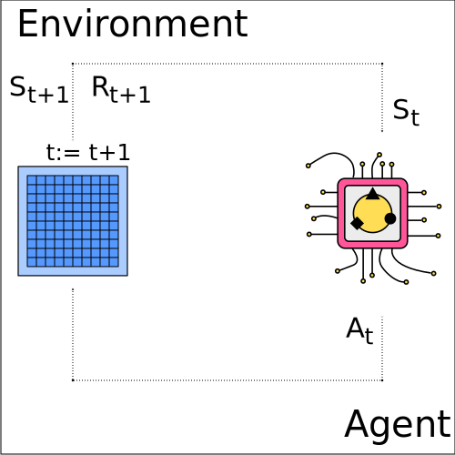
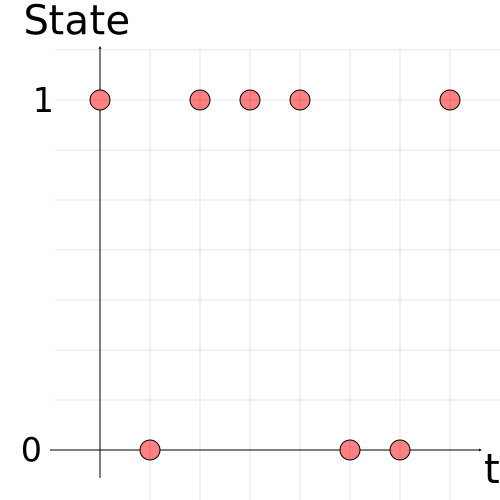
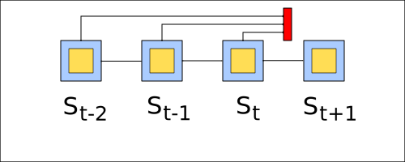
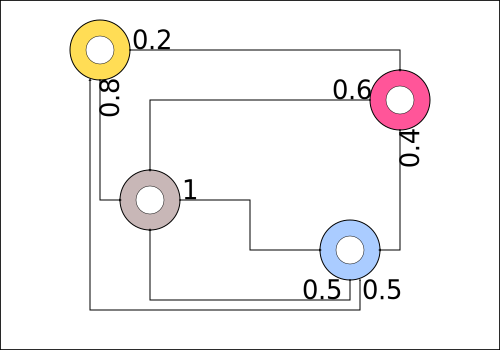
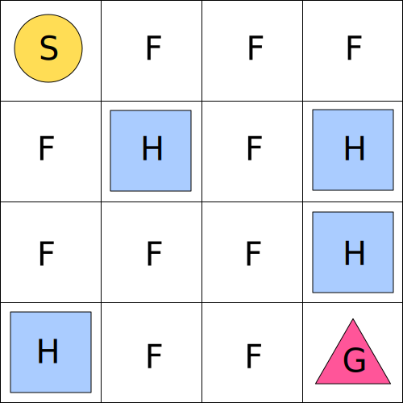
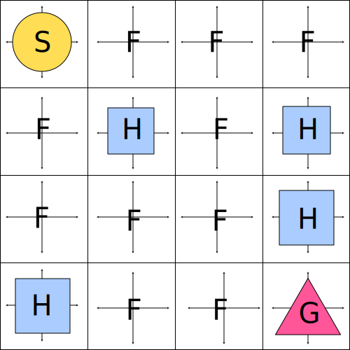
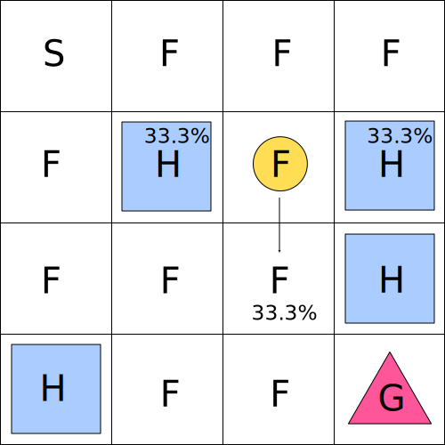
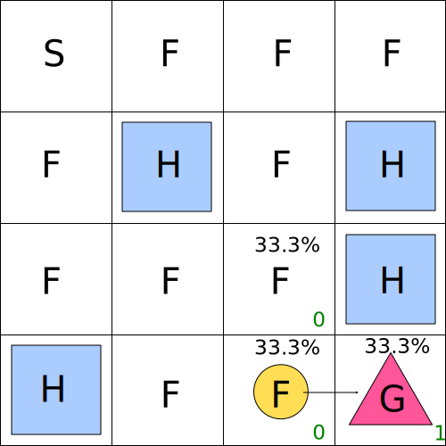

=======================================
Definition of a Markov Decision Process
=======================================

There are several different ways to introduce the Markov Decision Process. MDP as an interaction between the agent and the environment, MDP as a stochastic process and the most formal definition, MDP as a tuple. We are going to have a short look at all three.

MDP as Sequential Interaction
=============================

.. note::
   A Markov decision process (MPD) is a formal description of a sequential decision problem with uncertainty.

In essence an MDP allows us to formalize the interaction loop between the agent and the environment, where the actions of the agent influence future states/rewards and the agent might have to decide to forego the current reward to get higher rewards in the future. The common assumption in reinforcement learning is the existence of an MDP at the core of each environment.

   Interaction Loop.

The interaction is done sequentially, where the agent and the environment take turns to react to each other. Each iteration of actions, rewards and states happens in a period of time, called a time step, :math:`t`. The time step is a discrete variable starting at 0 and increasing by 1 after each iteration. During the first time step the agent receives the initial state of the environment :math:`S_0` and reacts accordingly with the action :math:`A_0`. The environment transitions into a new state :math:`S_1` and generates the reward :math:`R_1`. The agent in turn reacts with the action :math:`A_1` and the interaction continues. The general notation of writing States, Actions and Rewards is :math:`S_t, A_t, R_t` where the subscript :math:`t` represents a particular time step.

From a Stochastic Process to an MDP
===================================

A Markov decision process consists of three parts. It involves a stochastic **process**, it abides by the **markov** property and there is the possibility to influence the states through **decisions**.

Stochastic Process
------------------

.. note:: 
   A stochastic or random process can be defined as a sequence of random variables.

   Bernoulli Process.

In the above image there are no actions or rewards yet and the state evolves randomly over time following a stochastic process. There are two distinct states that the process can be in, the 1 and the 0. Each of the states can be reached  with 50% probability and the new state does not depend on any previous states. In essence this random process corresponds to a sequence of coin tosses where for example heads would correspond to 0 and tails to 1. This is a Bernoulli process.

For the above process the following can be said: :math:`Pr(S_{t+1} \mid S_t) = Pr(S_{t+1})`

:math:`Pr(S_{t+1})` is the probability that a certain state will be tossed, in the above case :math:`Pr(S_{t+1}=HEADS) = 0.5` and :math:`Pr(S_{t+1}=TAILS)=0.5`. :math:`Pr(S_{t+1} \mid S_t)`, reads as x given y, depicts a conditional probability, where the probability of being in the new state :math:`S_{t+1}` depends on the current state :math:`S_t`. For example :math:`Pr(S_{t+1}=HEADS|S_t=TAILS)` shows the probability of a coin toss having a value of HEADS when the previous toss had a value of TAILS. When you consider a coin toss, then the new occurrence of either heads or tails does not depend on the previous specific value of the toss. The events are independent. :math:`Pr(S_{t+1} \mid S_t) = Pr(S_t)` means that knowing the last value of a coin toss does not give us any more knowledge regarding the future toss. :math:`Pr(S_{t+1} \mid S_t) = Pr(S_t) = 0.5`.

.. list-table:: Bernoulli Process

   * - Process
     - yes
   * - Markov
     - no
   * - Decisions
     - no

The Bernoulli process is a stochastic process as the states evolve randomly but to be considered an MDP it needs to be Markovian. Furthermore there is no way to influence the environment through actions.

Markov Chain
------------

.. note::
   A Markov chain is a stochastic process that has the Markov property. 
    
   Markov property: :math:`Pr[S_{t+1} \mid S_t] = Pr[S_{t+1} \mid S_1, .... , S_t]` 
    
   The Markov property, or memorylessness, means that the next state only depends on the current state and not the states before that. 
    

   Markov Property.

Unlike in the coin toss example, in a Markov chain the probability to be in the state :math:`S_{t+1}` depends on previous states, but only the most recent state, :math:`S_t`, is relevant. The above image shows that the new state depends on the previous state, while the previous information, the states that came before that, is irrelevant. The markov property is extremely convenient, as only the most recent events need to be tracked, which allows for more tractable computations.

   Markov Chain.

Each of the color coded circles above represents a state, while the numeric values near the arrows represent the transition probabilities from one state to another state. For example when the state is yellow there is a 20% chance to land in the red state and an 80% chance to land in the grey state. What state came before the yellow state is absolutely irrelevant. 

.. figure:: ../../_static/images/reinforcement_learning/math/mdp_definition/markov_chain_unrolled.svg
   :align: center

   An unfolded Markov Chain.

If we unfold the process and follow it for a while, the above sequence might for example appear. The mathematical notation would look as follows.

.. math::
   S_0, S_1, S_2, S_3, S_4, ..., S_t

.. list-table:: Markov Chain

   * - Process
     - yes
   * - Markov
     - yes
   * - Decisions
     - no

The Markov chain is a stochastic process. The sequence of states develops randomly, but unlike the Bernoulli process which does not depend on any previous state the Markov process depends on the last and only on the last state. Still the agent can not take any actions that impact the environment.

MDP
---

A Markov chain can be extended to a Markov decision process with the introduction of rewards and actions. While in the case of a Markov chain the states evolve without any possibility of an influence on the environment, in the case of an MDP the agent has “agency” over his actions and gets rewards for his behaviour.

.. figure:: ../../_static/images/reinforcement_learning/math/mdp_definition/markov_decision_process.svg
   :align: center

   A Markov Decision Process.

The above image depicts an MDP with 4 states (yellow, red, grey and blue). The blue is the final state that the agent has to reach. The agent can influence the environment by taking one of the 2 available actions (the reddish and the bluish action). Landing in the first 3 states generates a negative reward (inner red circle), while landing in the blue state generates a positive reward (inner green circle). 

The unrolled MDP forms a sequence of States, Actions and Rewards, called a trajectory.

.. math::
   S_0, A_0, R_1, S_1, A_1, R_2, S_2, A_2, ...

.. list-table:: MDP

   * - Process
     - yes
   * - Markov
     - yes
   * - Decisions
     - yes

An MDP is a stochastic process as the generation of new states develops in a random fashion. It is Markov, as only the last state :math:`S_t` and the last action :math:`A_t` are necessary to calculate the new State :math:`S_{t+1}`. The agent can interact with the MDP to influence future states and rewards.

MDP as a Tuple
==============

.. note::
   A tuple is a finite ordered list of elements
  

In more mathematical terms a Markov decision process is a 5-tuple, :math:`(\mathcal{S, A}, P, R, \gamma)`. In the following sections we will take a look at each of the contents of the tuple individually.
   
Frozen Lake
-----------

   The Frozen Lake Environment.

To explain the contents of the tuple I will introduce a new environment. “Frozen Lake” is a beginner level environment, suited well to explain the underlying components of an MDP. As the name of the environment suggests, the surface of the lake is frozen. This causes the surface to be either safe, but slippery or not safe at all. The player starts at the top left corner (indicated by the letter S as in Start). The goal of the environment is to reach the bottom right corner (indicated by the letter G as in Goal). The safe surface comprises the F (F as in Frozen) and the G cells. The unsafe surface is indicated by the H (H as in Hole) cells. The reward is in most cases 0, unless the agent reaches the goal where he achieves a reward of 1. The agent can move in 4 directions. When the agent tries to move into the direction of the wall the resulting state is the same as the previous state. The environment itself is stochastic. When the agent chooses an action in ⅓ of the cases the environment moves the player in that direction, while in ⅔ of the cases the player is moved left or right of the desired direction (divided equally). 

   Moving in the Frozen Lake Environment.

:math:`\mathcal{S}`: States
---------------------------

.. note:: 
   :math:`\mathcal{S}` is the set of all legal states

   States in the Frozen Lake Environment.

In the Frozen Lake environment the set of all allowed states looks as follows :math:`\mathcal{S} = \{0, 1, 2, 3, 4, 5, 6, 7, 8, 9, 10, 11, 12, 13, 14, 15\}`. A number from the set corresponds to a location in the grid world and is not allowed to deviate from the set, e.g. the environment can not present the agent with a state that corresponds to the number 32.

   
:math:`\mathcal{A}`: Actions
----------------------------
.. note::
   :math:`\mathcal{A}` is the set of all legal actions

   Actions in the Frozen Lake Environment.

In the Frozen Lake environment the set of all legal actions is :math:`\mathcal{A} = \{0, 1, 2, 3\}`, where

* 0 = Left
* 1 = Down
* 2 = Right
* 3 = Up
   
From the set of actions you can recognize that movement in diagonal directions or jumping over several cells is not allowed.
   

:math:`P`: Transitions
----------------------

.. note:: 
   :math:`P` is the transition model. 

   :math:`P(s' \mid s, a) \doteq Pr[S_{t+1}=s' \mid S_t=s, A_t=a]`

   The transition model is the function  that calculates the probability of landing in some state :math:`s'` at timestep :math:`t+1` when at timestep :math:`t` the state corresponds to :math:`s` and the action taken by the agent is :math:`a`.

   Transision Model in the Frozen Lake Environment.

In the above example the state is marked by the yellow circle, which corresponds to the state with the value of 6. If the agent takes the action 1 (going down), the transition function will calculate the following results.

* :math:`P(5 \mid 6, 1) = 1/3 = 33.3\%`, chance of moving left
* :math:`P(7 \mid 6, 1) = 1/3 = 33.3\%`, chance of moving right
* :math:`P(10 \mid 6, 1) = 1/3 = 33.3\%`, chance of moving down
   
:math:`R`: Rewards
------------------

.. note::
   :math:`R` is the reward model. 

   :math:`R(s,a) \doteq \mathbb{E}[R_{t+1} \mid S_{t}=s, A_{t}=a]`
   
   The reward model is the function that calculates the expected value of the reward given state :math:`s` and action :math:`a` at time step :math:`t`.

   Reward Model in the Frozen Lake Environment.

In the above image the state of the environment equals 14. The agent selects to move right (action 2). 

.. math::
   R(14, 2) = \mathbb{E}[R_{t+1} \mid S_t = 14, A_t = 2] = 0 * 1/3 + 0 * 1/3 + 1 * 1/3 = 1/3.

The expected reward equals 1/3 when the agent takes the action 2 in the state 14. 
   

:math:`\gamma`: Discounts
-------------------------

.. note::
   :math:`\gamma` (gamma) is the discount factor, where :math:`0 \leq \gamma \leq 1`.

   Gamma is used to calculate the current value of future rewards.

Consider the following example. You can get 1000$ now or 1000$ in 10 years. What would you choose? The answer is hopefully 1000$ now. The reason every rational agent would choose 1000$ is the time value of money or generally speaking the time value of rewards. In the case of dollars you could invest the money for 10 years and get an amount that is larger. Therefore there should be a compensation if the agent decides to delay his reward. The gamma or discount factor is used to adjust the value of rewards. Future rewards are considered of less value. 

The value of rewards from the perspective of the agent at time step :math:`t` is as following:

* The value of a reward received at timestep :math:`t+1` is :math:`\gamma^0 * R_{t+1}`
* The value of a reward received at timestep :math:`t+2` is :math:`\gamma^1 * R_{t+2}`
* The value of a reward received at timestep :math:`t+3` is :math:`\gamma^2 * R_{t+3}`

.. note::
   Episodic tasks are tasks that have a natural ending.
   
   Continuing tasks are tasks that do not have a natural ending and may theoretically go on forever. 

Mathematically speaking if you are dealing with episodic tasks, like the Frozen Lake environment,  then the discount factors are not strictly required. For continuing tasks a discount factor is required. The reason for that is the need for the agent to maximize the expected sum of future rewards. If the task is continuing then the sum of rewards might become infinite and the agent can not deal with that. If the value of gamma is between 0 and 1 then the sum becomes finite. 

Usually the value of gamma is between 0.9 and 0.99. 

Let’s assume a gamma with a value of 0.9.

* At :math:`t+3`: the discount factor is :math:`\gamma^2 = 0.81`
* At :math:`t+5`: the discount factor is :math:`\gamma^4 = 0.66`
* At :math:`t+11`: the discount factor is :math:`\gamma^{10} = 0.35`
* At :math:`t+21`: the discount factor is :math:`\gamma^{20} = 0.12`
* At :math:`t+51`: the discount factor is :math:`\gamma^{50} = 0.005`

The discount factor keeps approaching 0, which makes the value of rewards in the far future almost 0. That prevents an infinite sum of rewards. 
   
