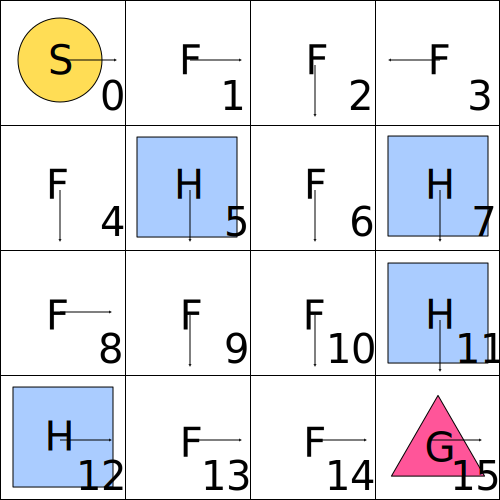

===============
To Solve an MDP
===============

Once a particular MDP, the components of the tuple :math:`(\mathcal{S, A}, P, R, \gamma)`,  has been defined the next logical step would be to solve the MDP. In this chapter I am going to explain what it actually means to solve an MDP. In future chapters I will try to explore possible approaches to a solution.

Return
======

.. note::

   **Episodic Tasks**:

   In episodic tasks the return is the sum of rewards in a single episode starting from time step :math:`t` and going up to the terminal time step :math:`T`.
   
   :math:`G_t = R_{t+1} + R_{t+2} + … + R_T`
   
   **Continuing Tasks**:

   In continuing tasks the return is the sum of rewards starting at time step t and going to possibly infinity, :math:`T = \infty`.
   
   :math:`G_t = R_{t+1} + R_{t+2} + R_{t+3} + …  = \sum_{k=0}^\infty{R_{k+t+1}}`

In order to simplify notation I will introduce the notion of a return :math:`G`. A return is simply the sum of rewards starting from some time :math:`t` and going either to some terminal state :math:`T` or to infinity. The letter :math:`G` stands for “Goal”, because the goal of the environment is encoded in the rewards. 

.. figure:: ../../_static/images/reinforcement_learning/math/mdp_solution/frozen_lake_return.svg
   :align: center

   Frozen Lake Return.

In order to calculate the full return of an episode we have to play through the sequence of states, actions and rewards all the way through from the initial state to the terminal state. Let us assume that the sequence of states and the corresponding rewards played out as indicated in the image above. The agent received the reward of 0 for getting to the non terminal states and a reward of 1 for getting to the terminal state at the bottom right corner. Altogether there were 9 time steps starting from the initial time step t = 0 and ending with the timestep T = 8. 

.. math::
   :nowrap:
   
   \begin{align*} 
   G_0 & = R_1 + R_2 + R_3 + R_4 + R_5 + R_6 + R_7 + R_8 \\
   & = 0 + 0 + 0 + 0 + 0 + 0 + 0 + 1 = 1
   \end{align*}
   
.. note::
    Discounted Return
    
    .. math::
       G_t = R_{t+1} + \gamma{R_{t+2}} + \gamma^2{R_{t+3}} + …  = \sum_{k=0}^\infty{\gamma^k{R_{k+t+1}}}
 

To avoid an infinite return (in continuing tasks), future rewards  are discounted by :math:`\gamma`. Episodic tasks use discounting to emphasize the time value of rewards. Looking at the same example from above the return :math:`G_0` looks as follows when we assume a gamma :math:`\gamma` of *0.9*.

.. math::
   :nowrap:

   \begin{align*} 
   G_0 & = R_1 + 0.9R_2 + 0.9^2 R_3 + 0.9^3 R_4 + 0.9^4 R_5 + 0.9^5 R_6 + 0.9^6 R_7 + 0.9^7 R_8 \\
   & = 0 + 0 + 0 + 0 + 0 + 0 + 0 + 0.48 = 0.48 
   \end{align*}

In the example without discounting the return would always be 1 as long as the agent reaches the goal state. That means that it is generally not important how many steps the agent takes. This is not the case with discounting. Taking the shorter route corresponds to a higher expected return, as the time value of a reward is reduced the farther away it is from the current time step :math:`t`. That essentially means that in the above example discounting generally encourages the agent to take as few steps as possible. 

.. note::
   The goal of the agent is to maximize the expected (discounted) sum of rewards. In other words the goal of the agent is to maximize the expected return :math:`\mathbb{E}(G_t)`.

To solve an MDP means for the agent to maximize the expected return.

.. note::
   .. math::
      :nowrap:

      \begin{align*}
      G_t & = R_{t+1} + \gamma{R_{t+2}} + \gamma^2{R_{t+3}} + … \\
      & = R_{t+1} + \gamma{(R_{t+2} + \gamma{R_{t+3}} + ...)} \\
      & = R_{t+1} + \gamma{G_{t+1}}
      \end{align*}

An important property of returns is that they can be expressed in terms of future returns.

Using this property we get the same result as above. 

.. math::
   :nowrap:

   \begin{align*}
   & G_0 = R_1 + \gamma G_1 \\
   & R_1 = 0 \\
   & G_1 = R_2 + 0.9 R_3 + 0.9^2 R_4 + 0.9^3 R_5 + 0.9^4 R_6 + 0.9^5 R_7 + 0.9^6 R_8 = 0.53 \\
   & G_0 = 0 + 0.9 * 0.53 = 0.48
   \end{align*}

Policy
======

.. note::

   A policy can be defined in several ways.

   If a policy is *deterministic* then it is usually the case that we define policy as a mapping from state :math:`s` to action :math:`a`. In that case the notation that we use for policy is :math:`\mu(s)`. To generate an action :math:`A_t` at timestep :math:`t` we input the state :math:`S_t` into the policy function:  :math:`A_t = \mu(S_t)`.

   If a policy is *stochastic* then we define policy as a mapping from a state :math:`s` to a probability of an action :math:`a` and the mathematical notation is :math:`\pi{(a \mid s)} = Pr[A_t = a \mid S_t = s]`. The “probability” notation can also be used in a deterministic case. For a deterministic policy :math:`\pi{(a \mid s) = 1}` for for the selected action and :math:`\pi{(a \mid s) = 0}` for the rest of the actions. 

   To generate an action we consider :math:`\pi{(. \mid S_t)}` to be the distribution of actions given states. Actions are draws from a policy distribution :math:`A_t \sim \pi{(. \mid S_t)}`, where in a deterministic case the same action is always drawn given the same state. 

The policy of an agent determines the behaviour of the agent expressed in terms of actions based on the current state of the environment.  

   Frozen Lake Policy.

The above image shows the actions that would be generated by a deterministic policy based on the 15 distinct states. 

.. list-table:: Policy for the frozen lake
   :header-rows: 1

   * - State :math:`s`
     - :math:`\pi(left \mid s)`
     - :math:`\pi(top \mid s)`
     - :math:`\pi(right \mid s)`
     - :math:`\pi(bottom \mid s)`
   * - 0
     - 0
     - 0
     - 1
     - 0
   * - 1
     - 0
     - 0
     - 1
     - 0
   * - 2
     - 0
     - 0
     - 0
     - 1
   * - 3
     - 1
     - 0
     - 0
     - 0
   * - 4
     - 0
     - 0
     - 0
     - 1
   * - 5
     - 0
     - 0
     - 0
     - 1
   * - 6
     - 0
     - 0
     - 0
     - 1
   * - 7
     - 0
     - 0
     - 0
     - 1
   * - 8
     - 0
     - 0
     - 1
     - 0
   * - 9
     - 0
     - 0
     - 0
     - 1
   * - 10
     - 0
     - 0
     - 0
     - 1
   * - 11
     - 0
     - 0
     - 0
     - 1
   * - 12
     - 0
     - 0
     - 1
     - 0
   * - 13
     - 0
     - 0
     - 1
     - 0
   * - 14
     - 0
     - 0
     - 1
     - 0
   * - 15
     - 0
     - 0
     - 1
     - 0

The table is the policy that corresponds to the image above. 

Value Functions
===============

.. note::
   State-Value Function:

   .. math::
      v_{\pi}(s) = \mathbb{E_{\pi}}[G_t \mid S_t = s]

   Action-Value Function:

   .. math::
      q_{\pi}(s, a) = \mathbb{E_{\pi}}[G_t \mid S_t = s, A_t = a]
      

Value functions map states or state-action pairs to “goodness” values, where goodness is expressed as the expected sum of rewards. Higher values mean more favorable states or state-action pairs. 

The state-value function expresses the expected return when following a particular policy :math:`\pi` given the state :math:`s`. The action-value function expresses the expected return given the state :math:`s` while taking the action :math:`a` in the current step and following the policy :math:`\pi` afterwards.  

Bellman Equations
=================

By using the properties of returns :math:`G_t` where each return can be expressed in terms of future returns :math:`G_t = r_{t+1} + \gamma G_{t+1}` we can arrive at recursive equations, where a value of a state can be defined in terms of values of the next state. 

.. note::
   Bellman equation for the state-value function

   .. math::
      :nowrap:
      
      \begin{align*}
      v_{\pi}(s) & = \mathbb{E_{\pi}}[G_t \mid S_t = s] \\
      & = \mathbb{E_{\pi}}[R_{t+1} + \gamma G_{t+1} \mid S_t = s] \\
      & = \mathbb{E_{\pi}}[R_{t+1} + \gamma v_{\pi}(S_{t+1}) \mid S_t = s]
      \end{align*}

   Bellman equation for the action-value function

   .. math::
      :nowrap:

      \begin{align*}
      q_{\pi}(s, a) & = \mathbb{E_{\pi}}[G_t \mid S_t = s, A_t = a] \\
      & = \mathbb{E_{\pi}}[R_{t+1} + \gamma G_{t+1} \mid S_t = s, A_t = a] \\
      & = \mathbb{E_{\pi}}[R_{t+1} + \gamma v_{\pi}(S_{t+1}) \mid S_t = s, A_t = a]
      \end{align*}

Equations of the above form are called Bellman equations, named after the mathematician Richard E. Bellman. At the very first glance it might not seem like the equations add additional benefit to the definition of value functions, but the recursive relationships is what makes many of the reinforcement learning algorithms work. 

Optimality
==========

.. note::
   To solve an MDP is to find the optimal policy!
    
At the beginning of the chapter we asked ourselves what it means to solve a Markov decision process. The solution of an MDP means that the agent has learned an optimal policy function. Optimality implies that there is a way to compare different policies and to determine which of the policies is better.

.. note::
   Policies are evaluated in terms of their value functions

   :math:`\pi \geq \pi’` if and only if :math:`v_{\pi}(s) \geq v_{\pi'}(s)` for all :math:`s \in \mathcal{S}`

In finite MDPs value functions are used as a metric of the goodness of a policy. The policy  pi is said to be better than the policy pi’ if and only if the value function of pi is larger or equal to the value function of policy pi’ for all states in the state set S. 

.. note::

   The optimal policy :math:`\pi_*` is defined as

   
   :math:`\pi_* \geq \pi` for all :math:`\pi`

The optimal policy is the policy that is better (or at least not worse) than any other policy.   

.. note::
   The optimal state-value funtion:

   :math:`v_*(s) = \max_{\pi} v_{\pi}(s)` for all states :math:`s \in \mathcal{S}`

   The optimal action-value function:

   :math:`q_*(s, a) = \max_{\pi} q_{\pi}(s, a)` for all states :math:`s \in \mathcal{S}` and all actions :math:`a \in \mathcal{A}`

The state-value function and the action-value function that are based on the optimal policy are called optimal state-value and optimal action-value function respectively. 

.. important::
   There might be several optimal policies, but there is always only one optimal value function.

Bellman Optimality Equations
============================

For finite MDPs the common approach is to calculate the optimal value functions :math:`v_*` and/or :math:`q_*` and to deduce the optimal policy :math:`\pi_*` from those.

.. note::
   Bellman Optimality Equation for the state-value function:

   .. math::
      :nowrap:

      \begin{align*}
      v_*(s) & = \max_{a} q_{{\pi}_*}(s, a) \\
      & = \max_{a} \mathbb{E_{\pi_{*}}}[G_t \mid S_t = s, A_t = a] \\
      & = \max_{a} \mathbb{E_{\pi_{*}}}[R_{t+1} + \gamma G_{t+1} \mid S_t = s, A_t = a] \\
      & = \max_{a} \mathbb{E}[R_{t+1} + \gamma v_*(S_{t+1}) \mid S_t = s, A_t = a]
      \end{align*}

   Bellman Optimality Equation for the state-value function:

   .. math::
      :nowrap:

      \begin{align*}
      q_*(s, a) & = \mathbb{E}[R_{t+1} + \gamma v_*(S_{t+1}) \mid S_t = s, A_t = a] \\
      & = \mathbb{E}[R_{t+1} + \gamma \max_{a'} q_*(S_{t+1}, a') \mid S_t = s, A_t = a]
      \end{align*}

For that purpose the Bellman equations of optimal value functions are required. These are called Bellman optimality equations.

Summary
=======

In order to solve an MDP we need to learn the optimal policy. The optimal policy in turn is calculated using optimal state-value and action-value functions. 
