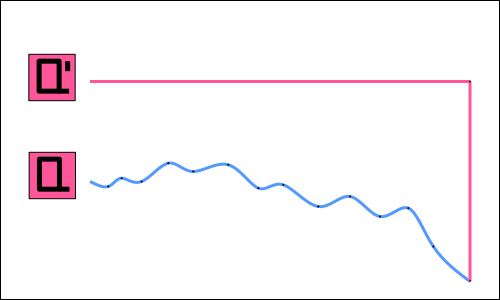

===========================
Additional DQN Improvements
===========================

There are still some tricks which we have not yet covered that might help to speed up training. These tricks are not specifically covered in a separate research paper, but have still become the norm in the common reinforcement learning libraries. This section is dedicated to those improvements.

Polyak Averaging
================

   Classic DQN Target Network Update.

The traditional DQN update to the target network is done every :math:`n` steps. Between the updates we keep the target network constant. This is done in order to keep the target values constant so as not to destabilize the training. But this process introduces some problems on its own. When the update is done only each several thousand steps the target network gets more and more out of date as we get closer to :math:`n`. The abrupt update that is eventually done to the target values might destabilize the training process. 

.. figure:: ../../_static/images/reinforcement_learning/modern_value_based_approximation/additional_dqn_improvements/polyak_update.svg
   :align: center

   DQN Target Network Update with Polyak Averaging.

Polyak averaging makes the updates of the target network smooth. The update is usually performed every single step, but the magnitude of the update is limited. 

.. math:: 

	\mathbf{w}_{target} \leftarrow \mathbf{w}_{target} * (1 - \tau) + \mathbf{w}_{current} * \tau

For that purpose we define the factor :math:`\tau`, which lies between 0 and 1, but is usually close to 0.01. The new weights of the target network are kept close to the old target network weights but a small part of the current weights is mixed in. This allows for a smooth transition towards the most current weights :math:`\mathbf{w}`.

.. code:: python

    def update_target_network(self):
        with torch.no_grad():
            for online, target in zip(self.online_network.parameters(), self.target_network.parameters()):
                target.data.mul_(1 - self.tau)
                target.data.add_(online.data * self.tau)

The only change that we have to implement is to the function update_target_network. The update of the weights is done inline by mixing the target and the current (online) weights.

Huber Loss
==========