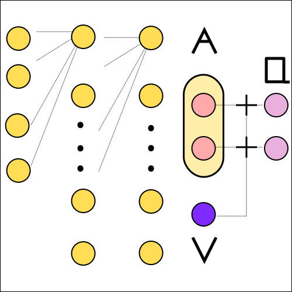

============
Duelling DQN 
============

Motivation
==========

.. note::

     "Our dueling network represents two separate estimators: one for the state value function and one for the state-dependent action advantage function [#]_. "

The neural network architectures that we have seen so far were not much different from typical convolutional or fully connected neural networks that are used in supervised learning. With the duelling DQN the researchers at DeepMind adjusted the DQN architecture in a way that is tailored specifically to reinforcement learning problems. 

Theory
======

So far we covered several quantities that are used throughout reinforcement learning. The state value function :math:`V_{\pi}(s) = \mathbb{E_{\pi}}[G_t \mid S_t = s]` measures the goodness of a state. It is the expected return when following the policy :math:`\pi`. The action value function :math:`Q_{\pi}(s, a) = \mathbb{E_{\pi}}[G_t \mid S_t = s, A_t = a]` measures the value of taking the action :math:`a` and then following the policy :math:`\pi`.

In this section we introduce the advantage function :math:`A(s,a)` that measures the advantage of taking the policy :math:`a` and then following policy :math:`\pi` instead of always following :math:`\pi`.

.. math:: 

    A(s, a) = Q(s, a) - V(s)

In other words the action value function can be rewritten in the following way.

.. math:: 

    Q(s, a) = V(s) + A(s, a)

   Duelling DQN.

The architecture of the duelling DQN uses this exact interpretation of the action value function. In the first layers the weights are shared. In the later layers the single state value is calculated separately from the advantage values. The one state value is finally added to sevaral advantage values to reconstruct the action values.

There is still a problem if we implement the calculation of the action value Q(s,a) naively as the sum of the state value V(s) and the advantage values A(s, a). Imagine we have four possible actions and the action value function Q(s, a) returns the following values [18, 15, 16, 16] for a particular state s. There is no unique solution to represent the action values as the sum of the advantages and the state value. If we assume that the state value is 10, then the advantages amount to [8, 5, 6, 6]. If we assume that the state value is 16 then advantages are [2, -1, 0, 0]. There are an unlimited number of possible combinations and therefore the training of the neural network is not going to be stable. 

To stabilize the training process we need to remove a degree of freedom in order to enforce unique solutions. The researchers at DeepMind suggested several solutions. Let us first think about how large the advantage is if we follow the greedy policy. The greedy policy selects the action with the highest possible value and therefore by design the advantage is always 0 if the agent picks the greedy action. 

.. math:: 

    Q(s, a) = V(s) + A(s, a) - \max_a A(s, a)

By using the above equation we enforce the advantage for the highest action value to be 0. Let us look at the same example where the action values correspond to [18, 15, 16, 16]. The solution that we come up with to make both sides of the equation equal is to set the state value to 18 and the advantages to [0, -3, -2, -2].

A different solution that the authors suggest is to subtract the average advantage.

.. math:: 

    Q(s, a) = V(s) + A(s, a) - \frac{1}{\mathcal{|A|}} \sum_a A(s, a)

Even though we lose the nice property that the highest advantage is 0, this version is more stable according to the paper. The values are offset by a constant, but the relative distribution remains.

Implementation
==============

.. code:: python

    class Q_FC(nn.Module):
        
        def __init__(self, obs_dims, n_actions):
            super(Q_FC, self).__init__()
            self.fc_1 = nn.Linear(in_features=obs_dims, out_features=64)
            self.fc_2 = nn.Linear(in_features=64, out_features=128)
            self.a = nn.Linear(in_features=128, out_features=n_actions)
            self.v = nn.Linear(in_features=128, out_features=1)
            
        
        def forward(self, state):
            x = F.relu(self.fc_1(state))
            x = F.relu(self.fc_2(x))
            
            advantage = self.a(x)
            state_value = self.v(x)
            
            return state_value + advantage - advantage.mean(dim=1, keepdim=True)
            
Sources
=======

.. [#] Wang Z. et al.  Dueling Network Architectures for Deep Reinforcement Learning. 2015.  https://arxiv.org/abs/1511.06581