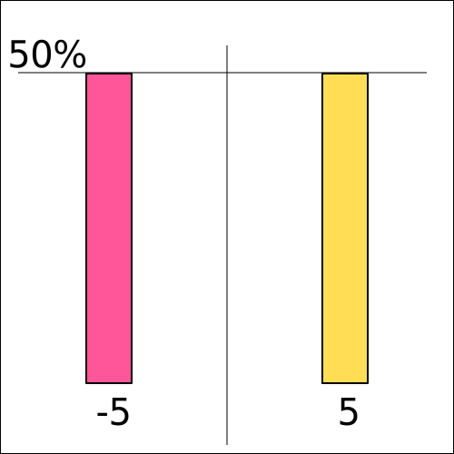
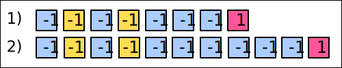

======================
Bias-Variance Tradeoff
======================

Motivation
==========

The bias-variance tradeoff plays a tremendous role in reinforcement learning and machine learning in general. Ideally we want to reduce both as much as possible, but reducing one means increasing the other at the same time. There is a tradeoff to be made. 

In this section we will look at the definitions of bias and variance and discuss at what side of the spectrum monte carlo and temporal difference methods are.

Bias
====

.. note::

    .. math:: 

        bias(\hat{\theta}) = \mathbb{E}[\hat{\theta}] - \theta

In statiscics we define the bias of the estimator as the difference between the expected value of the estimator :math:`\mathbb{E}[\hat{\theta}]` and the true parameter :math:`\theta`. The true parameter :math:`\theta` that we are most interested in is the expected value :math:`\mathbb{E}[X]` of some random variable :math:`X`. 

.. figure:: ../../_static/images/reinforcement_learning/tabular_rl/bias_variance_tradeoff/random_variable.svg
   :align: center

   Distribution of a random variable X.

In the image above we see the distribution of the random variable :math:`X`. The calculation of the expectation is straightforward when we know the actual probability distribution.

.. math::

    \mathbb{E}[X] = 0.15 * 1 + 0.15 * 2 + 0.3 * 3 + 0.3 * 4 = 2.55

We do not know the true distribution of :math:`X` and can not directly calculate the expected value, therefore we have to use some estimate :math:`\hat{\theta}` as a proxy for the true :math:`\mathbb{E}[X]`. The most straightforward way to estimate the expected value of a random variable is to draw samples from the distribution and to use the individual samples :math:`X` as the estimate :math:`\hat{\theta}`. Is there any bias by using the random samples as an estimate. No, using :math:`X` as an estimate for :math:`\mathbb{E}[X]` intorduces no bias. 

.. math::
    :nowrap:

    \begin{align*}
    & \theta = \mathbb{E}[X] \\
    & \hat{\theta} = X \\
    & bias(\hat{\theta}) = \mathbb{E}[\hat{\theta}] - \theta = \mathbb{E}[X] - \mathbb{E}[X] = 0
    \end{align*}

If on the other hand we used the number 3 constantly as the estimate of the expected value, then that would definitely introduce a bias. 

.. math::
    :nowrap:

    \begin{align*}
    & \theta = \mathbb{E}[X] \\
    & \hat{\theta} = 3 \\
    & bias(\hat{\theta}) = \mathbb{E}[\hat{\theta}] - \theta = \mathbb{E}[3] - \mathbb{E}[X] = 3 - 2.55 = 0.45
    \end{align*}

   Distribution of a random variable X.

But how do the discussions regarding bias extend to the choice between monte carlo methods and temporal difference methods? The example above might provide some answers. Imagine an episodic environment where the agent starts at the left yellow box and has to arrive at the right red box. Each step that the agent takes generates a negative reward of -1. Only the terminal red state provides a positive reward. To make the calculations simple we make the environment and the policy of the agent fully deterministic. In our example the agent follows the strategy of always going right and the MDP always transitions in the desired way. We also do not use any discounting. Following these assumptions the agent receives a return :math:`G_t` of -2 at each single episode when he starts at the yellow state, which we designate as state 0. 

When we use policy evaluation our goal is to find the correct value function :math:`v_{\pi}(s)`, which is the expected value of the rewards :math:`G_t` when following the policy :math:`\pi`. It turns out that monte carlo methods are not biased, because we use the full returns :math:`G_t` as an estimator of the value function. 

.. math::
    :nowrap:

    \begin{align*}
    & \theta = \mathbb{E}[G_t] \\
    & \hat{\theta} = G_t \\
    & bias(\hat{\theta}) = \mathbb{E}[\hat{\theta}] - \theta = \mathbb{E}[G_t] - \mathbb{E}[G_t] = -2 - (-2) = 0 
    \end{align*}

The return is an unbiased estimator of the value function and that would not change even if the environment and the policy of the agent were stochastic. Therefore it is reasonable to collect samples of :math:`G_t` for the state 0 and to calculate the average :math:`\frac{1}{N}\sum_t^N G_t`.

This is not the case for temporal difference methods. Let us assume that we set the initial values of the state value function to 0, :math:`v_{\pi}(s) = 0`. TD methods use bootstrapping, therefore the estimate of the value for the 0th state is :math:`R_t + v_{\pi}(1) = -1 + 0 = -1`, which makes bootstrapping biased, :math:`\mathbb{E}[R_t + v_{\pi}(S_{t+1})] \neq \mathbb{E}[G_t]`.

The reason we can get away with this type of bias in bootstrapping is by improving the estimate of the next state :math:`v_{\pi}(S_{t+1})` with each iteration and thereby reducing the bias. 

Variance
========

.. note::

    .. math::

        var(\hat{\theta}) = \mathbb{E}[(\hat{\theta} - \mathbb{E}[\hat{\theta}])^2]

Intuitively the variance of an estimator tells us how strongly the estimator varies around the expected value of an estimator. 

.. figure:: ../../_static/images/reinforcement_learning/tabular_rl/bias_variance_tradeoff/low_variance.svg
   :align: center

   Low Variance.

Let us assume we face the above distribution and decide that we would like to use the random variable :math:`X` as the estimator for the expected value :math:`\mathbb{E}[X]`. The true expected value of the estimate is 0, but the individual draws from the distribution can vary around the expected value, the variance is not 0.  

.. math::
    :nowrap:

    \begin{align*}
    var(\hat{\theta}) & = \mathbb{E}[(\hat{\theta} - \mathbb{E}[\hat{\theta}])^2] \\
    & = \mathbb{E}[(\hat{\theta} - 0)^2] \\
    & = 0.5 [(1 - 0)^2] +  0.5 [(-1 - 0)^2] = 1
    \end{align*}

   High Variance.

The calculation looks different if we use the random variable :math:`X` as the estimate of the expected value of the above distribution. The expected value is the same, but the variance as you can imagine is higher. 

.. math::
    :nowrap:

    \begin{align*}
    var(\hat{\theta}) & = \mathbb{E}[(\hat{\theta} - \mathbb{E}[\hat{\theta}])^2] \\
    & = \mathbb{E}[(\hat{\theta} - 0)^2] \\
    & = 0.5 [(5 - 0)^2] +  0.5 [(-5 - 0)^2] \\
    & = 0.5 * 25 +  0.5 * 25 = 25
    \end{align*}

   Simple MDP with random policy.

Let us build some intuition regarding the variance in monte carlo vs temporal difference methods. We are going to use the same deterministic environment, but the policy is going to be absolutely random. 

   Trajectories with Monte Carlo methods.

Taking random actions even in a deterministic environment will generate different trajectories. Considering that the environment is also usually stochastic and the rules of the MPD are much more complex, you generally require a lot of samples to approximate the expected value. Unlike in the above example where we only draw a single random variable, in monte carlo methods in reinforcement learning the randomness accumulates through many actions and transitions.

.. figure:: ../../_static/images/reinforcement_learning/tabular_rl/bias_variance_tradeoff/temporal_difference.svg
   :align: center

   Trajectories with Temporal Difference methods.

The randomness in temporal difference methods is on the other hand manageable. In the simplest temporal difference approach we take a single action and add the result to the state or action value of the next state. In the above example the randomness is only present in the single stochastic action. The rest of randomness is already incorporated in the state value function. 

Monte Carlo methods have more variance and temporal difference methods have more bias. In practice we usually look for some compromise between the two extremes. 
