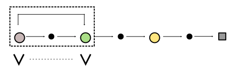

============================
Temporal Difference Learning
============================

Motivation
==========

.. note::

    "Whereas conventional prediction-learning methods assign credit by means of the difference between predicted and actual outcomes, the new methods assign credit by means of the difference between temporally successive predictions" [#]_. 

   Temporal Difference.

The above image shows the general idea of temporal difference (TD) methods. Instead of waiting for the end of an episode to use the difference between the predicted value function and the actual return :math:`G_t` temporal difference methods calculate the difference between the value of the current state :math:`s` and the value of the next state :math:`s’`. These methods utilize temporal (as in time) differences  in values in their update steps. As we do not have access to actual values for the next state we have to use estimates for prediction and target values, we have to bootstrap. Using temporal difference methods means that the agent does not have to wait for the end of the episode to apply an update step, but can update the estimations of the state or action value function after a single step.

Generalized Policy Iteration
============================
Temporal difference learning is also based on generalized policy iteration and we are going to cover prediction and improvement in two separate steps. 

TD Prediction
-------------

Theory
++++++

To solve the prediction problem means finding the true value function for a given policy :math:`\pi`. The value function takes a state :math:`s` as an input and calculates the expected reward. Mathematically this can be expressed as follows. 

:math:`v_\pi(s) = \mathbb{E}[G_t \mid S_t = s]`

If we use the Bellman equation we can rewrite the definition of the value function in terms of the value of the next state.

.. math::
    :nowrap:
    
    \begin{align*}
    v_{\pi}(s) & = \mathbb{E_{\pi}}[G_t \mid S_t = s] \\
    & = \mathbb{E_{\pi}}[R_{t+1} + \gamma v_{\pi}(S_{t+1}) \mid S_t = s]
    \end{align*}

Using the same logic the update step can be adjusted to reflect the recursive nature of the value function. The TD update rule uses bootsrapping, meaning that the target calculation is also based on an esimation.

.. note::
    Monte Carlo Update

    :math:`V(S_t) \leftarrow V(S_t) + \alpha [G_t - V(S_t)]`

    Temporal Difference Update

    :math:`V(S_t) \leftarrow V(S_t) + \alpha [R_{t+1} + \gamma V(S_{t+1}) - V(S_t)]`

Due to recursive notation the target of the update rule, :math:`R_{t+1} + \gamma v_{\pi}(S_{t+1})`, can be calculated at each single step. That means that it is not necessary to wait until the episode finishes to improve the estimate and that temporal difference learning is suited for continuing tasks. 

.. note::

    The TD-Error quantifies the difference between the bootstrapped target and the estimation.
    :math:`\delta_t \doteq R_{t+1} + \gamma V(S_{t+1}) - V(S_t)`

Algorithm
+++++++++

Compared to Monte Carlo prediction the TD prediction algorithm looks cleaner. The interaction step and the update step are consolidated and do not have to be put into different loops or functions.

.. math::
    :nowrap:

    \begin{algorithm}[H]
        \caption{Temporal Difference Prediction}
        \label{alg1}
    \begin{algorithmic}
        \STATE Input: environment $env$, policy $\mu$, state set $\mathcal{S}$, number of episodes, learning rate $\alpha$, discount factor $\gamma$
        \STATE Initialize: 
        \STATE $V(s)$ for all $s \in \mathcal{S}$ with zeros
        \FOR{$i=0$ to number of episodes}
            \STATE Reset state $S$
            \REPEAT
                \STATE Generate experience $tuple$ $(A,R,S')$ using policy $\mu$ and MDP $env$ 
                \STATE $V(S) = V(S) + \alpha [R + \gamma V(S') - V(S)]$
                \STATE $S \leftarrow S'$
            \UNTIL{state is terminal}
        \ENDFOR
        \STATE
        \STATE RETURN V(s)
    \end{algorithmic}
    \end{algorithm}

Implementation
++++++++++++++

The python implementation is also drastically cleaner.

.. code:: python

    def td_prediction(env, policy, S, num_episodes=100000, alpha=0.01, gamma=0.99):
    
        V = np.zeros(len(S))
        
        for episode in range(num_episodes):
            
            state = env.reset()
            done = False
            
            while not done:
                action = policy(state)
                next_state, reward, done, _ = env.step(action)
                V[state] = V[state] + alpha * (reward + gamma * V[next_state] - V[state])
                state = next_state
        
        return V

TD Control
----------

Similar to Monte Carlo there are On-Policy and Off-Policy control algorithms. Both need to estimate the action value function :math:`Q(s, a)` by interacting with the environment and gathering samples which can be used to improve the estimates and policies. 

SARSA (On-Policy)
+++++++++++++++++

Theory
######

SARSA is the On-Policy TD control algorithm. The same policy that is used to generate actions is also the one that is being improved. 

.. math:: 

    Q(S_t, A_t) \leftarrow Q(S_t, A_t) + \alpha [R_{t+1} + \gamma Q(S_{t+1}, A_{t+1}) - Q(S_t, A_t)]

Algorithm
#########

.. math::
    :nowrap:

    \begin{algorithm}[H]
        \caption{SARSA}
        \label{alg1}
    \begin{algorithmic}
        \STATE Input: environment $env$, state set $\mathcal{S}$, action set $\mathcal{A}$, number of episodes, learning rate $\alpha$, discount factor $\gamma$
        \STATE Initialize: 
        \STATE $Q(s, a)$ for all $s \in \mathcal{S}$ and $a \in \mathcal{A}$ with zeros
        \STATE $\epsilon$-greedy policy $\pi(a \mid s)$ for all $a \in \mathcal{A}$, where $A \sim \pi(. \mid s)$
        \STATE
        \FOR{$i=0$ to number of episodes}
            \STATE Reset state $S$
            \REPEAT
                \STATE Generate experience $tuple$ $(A,R,S',A')$ using policy $\pi$ and MDP $env$ 
                \STATE $Q(S, A) = Q(S) + \alpha [R + \gamma Q(S',A') - Q(S,A)]$
                \STATE $S \leftarrow S'$, $A \leftarrow A'$
            \UNTIL{state is terminal}
        \ENDFOR
        \STATE
        \STATE RETURN policy, Q(s,a)
    \end{algorithmic}
    \end{algorithm}

Implementation
##############

.. code:: python

    def sarsa(env, S, A, num_episodes=100000, alpha=0.01, gamma=0.99, epsilon=0.1):
    
        Q = np.zeros(shape=(len(S), len(A)))
        
        # an epsilon greedy policy
        def policy(state):
            if np.random.rand() < epsilon:
                action = env.action_space.sample()
            else:
                action = Q[state].argmax()
            return action
        
        for episode in range(num_episodes):
            state = env.reset()
            action = policy(state)
            done = False
            
            while not done:
                next_state, reward, done, _ = env.step(action)
                next_action = policy(next_state)
                Q[state, action] += alpha * (reward + Q[next_state, next_action] * (not done) - Q[state, action])
                state, action = next_state, next_action
        
        policy_mapping = np.argmax(Q, axis=1)
        policy = lambda x: policy_mapping[x]

        return policy, Q

Q-Learning (Off-Policy)
+++++++++++++++++++++++

Theory
######

Q-Learning is the On-Policy TD control algorithm. A different policy that is used to generate actions is being improved. Theoretically the algorithm should be able to learn the optimal control policy from a purely random action-selection policy. 

.. math:: 

    Q(S_t, A_t) \leftarrow Q(S_t, A_t) + \alpha [R_{t+1} + \gamma \max_a Q(S_{t+1}, a) - Q(S_t, A_t)]

Algorithm
#########

.. math::
    :nowrap:

    \begin{algorithm}[H]
        \caption{Q-Learning}
        \label{alg1}
    \begin{algorithmic}
        \STATE Input: environment $env$, state set $\mathcal{S}$, action set $\mathcal{A}$, number of episodes, learning rate $\alpha$, discount factor $\gamma$
        \STATE Initialize: 
        \STATE $Q(s, a)$ for all $s \in \mathcal{S}$ and $a \in \mathcal{A}$ with zeros
        \STATE $\epsilon$-greedy policy $\pi(a \mid s)$ for all $a \in \mathcal{A}$, where $A \sim \pi(. \mid s)$
        \STATE
        \FOR{$i=0$ to number of episodes}
            \STATE Reset state $S$
            \REPEAT
                \STATE Generate experience $tuple$ $(A,R,S')$ using policy $\pi$ and MDP $env$ 
                \STATE $Q(S, A) = Q(S) + \alpha [R + \gamma \max_aQ(S',a) - Q(S,A)]$
                \STATE $S \leftarrow S'$
            \UNTIL{state is terminal}
        \ENDFOR
        \STATE
        \STATE RETURN policy, Q(s,a)
    \end{algorithmic}
    \end{algorithm}

Implementation
##############

.. code:: python

    def q_learning(env, S, A, num_episodes=100000, alpha=0.01, gamma=0.99, epsilon=0.1):
    
        Q = np.zeros(shape=(len(S), len(A)))
        
        # an epsilon greedy policy
        def policy(state):
            if np.random.rand() < epsilon:
                action = env.action_space.sample()
            else:
                action = Q[state].argmax()
            return action
        
        for episode in range(num_episodes):
            state = env.reset()
            done = False
            
            while not done:
                action = policy(state)
                next_state, reward, done, _ = env.step(action)
                Q[state, action] += alpha * (reward + Q[next_state].max() * (not done) - Q[state, action])
                state = next_state
        
        policy_mapping = np.argmax(Q, axis=1)
        policy = lambda x: policy_mapping[x]

        return policy, Q

Sources
=======

.. [#] Sutton, R.S. Learning to predict by the methods of temporal differences. Mach Learn 3, 9–44 (1988). https://doi.org/10.1007/BF00115009 